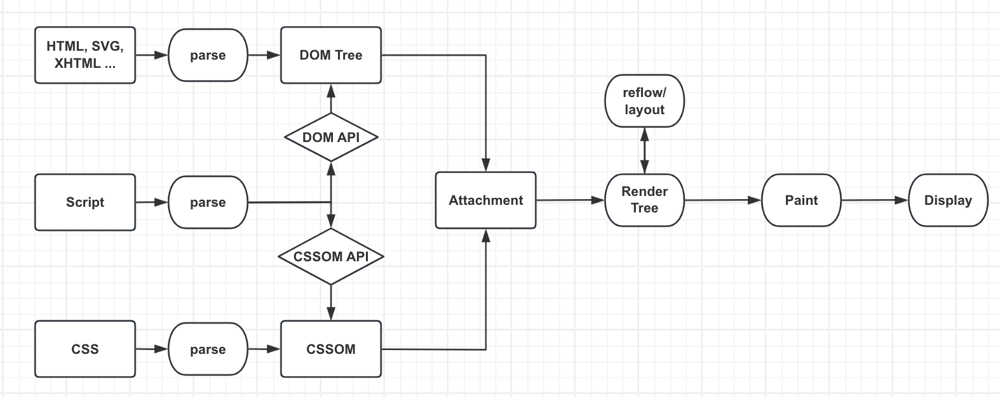
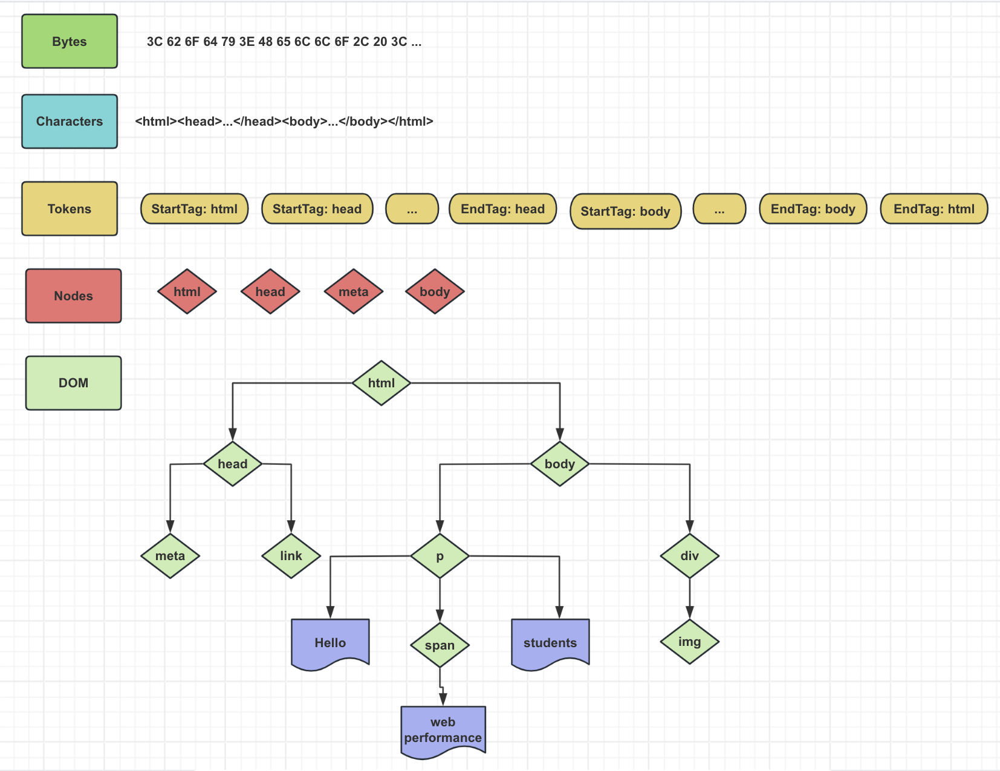
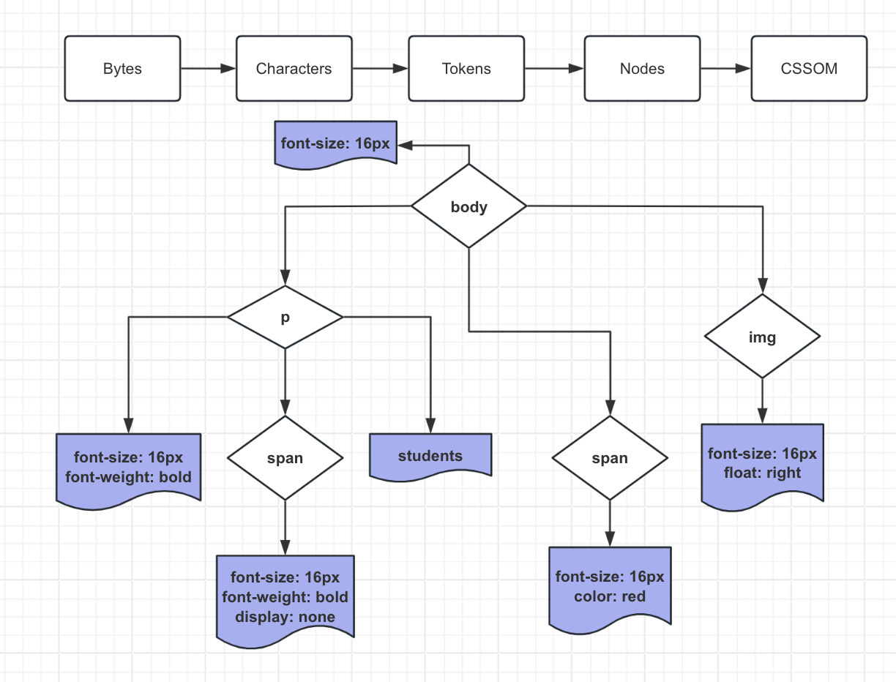
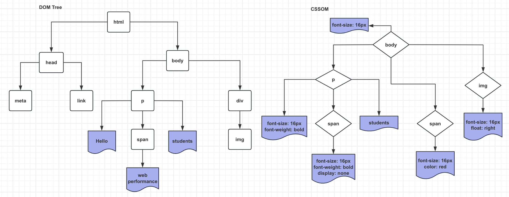
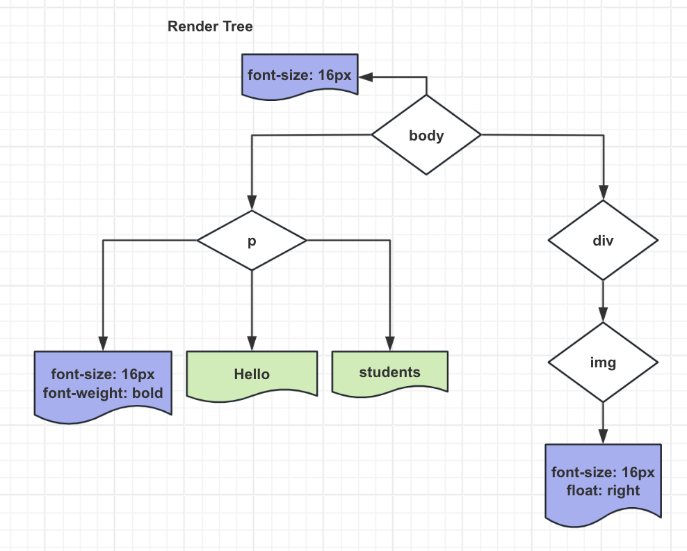
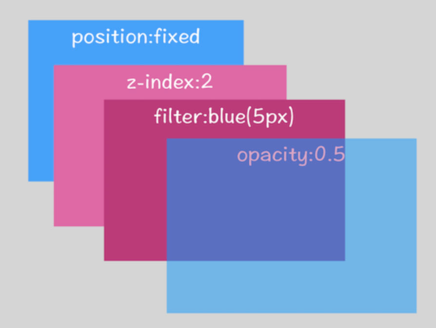

# 浏览器渲染

### 概要

默认情况下，`Chrome` 会为每个页面分配一个渲染进程，即每打开一个新页面就会配套创建一个新的渲染进程

例外：在某些情况下浏览器会让多个页面直接运行在同一个渲染进程中，什么情况下多个页面会同时运行在一个渲染进程中呢

要解决这个问题，需先了解什么是同一站点（`same-site`），具体地讲，将“同一站点”定义为`根域名（如 geekbang.org）`加上`协议（如 http:// 或 https://）`，还包含了**该根域名下的所有子域名和不同的端口**，如下面这三个：
```js
// 它们都属于同一站点，因为它们的协议都是 `HTTPS`，且根域名也都是 `geekbang.org`
https://time.geekbang.org
https://www.geekbang.org
https://www.geekbang.org:8080
```

`Chrome` 的默认策略：每个标签对应一个渲染进程，但若从一个页面打开另一个新页面，而新页面和当前页面属于同一站点，则新页面会复用父页面的渲染进程 --> 官方把这个默认策略叫 `process-per-site-instance`

若新页面和当前页面不属于同一站点，情况又会发生什么样的变化呢？如通过极客邦页面里的链接打开 `InfoQ` 的官网 `https://www.infoq.cn/`，因为 `infoq.cn` 和 `geekbang.org` 不属于同一站点，所以 `infoq.cn` 会使用一个新的渲染进程

总的来说，打开一个新页面采用的渲染进程策略是：
- 通常情况下，打开新的页面都会使用单独的渲染进程
- 若从 `A` 页打开 `B` 页，且 `A` 和 `B` 属于同一站点，则 `B` 页复用 `A` 页的渲染进程；否则，浏览器进程会为 `B` 创建一个新的渲染进程

渲染进程准备好后，不能立即进入文档解析状态，因为此时的文档数据还在网络进程中，并没有提交给渲染进程，所以下一步就进入了`提交文档`阶段

> `提交文档`，是指浏览器进程将网络进程接收到的 `HTML` 数据提交给渲染进程，具体流程：
> - 首先当浏览器进程接收到网络进程的响应头数据后，便向渲染进程发起`提交文档`的消息
> - 渲染进程接收到`提交文档`的消息后，会和网络进程建立传输数据的`管道`
> - 等文档数据传输完成后，渲染进程会返回`确认提交`的消息给浏览器进程
> - 浏览器进程在收到`确认提交`的消息后，会更新浏览器界面状态，包括了安全状态、地址栏的 `URL`、前进后退的历史状态，并更新 `Web` 页面
>
> 其中，当渲染进程确认提交后，更新内容如下图所示：

> 
> 这也就解释了为什么在浏览器的地址栏里面输入了一个地址后，之前的页面没有立马消失，而是要加载一会儿才会更新页面


从上图中可以看出，输入 `HTML`、`CSS`、`JavaScript` 的数据，经过中间渲染模块的处理，最终输出为屏幕上的像素
> 渲染模块在执行过程中会被划分为很多子阶段，输入的数据经过这些子阶段，最后输出像素，这个处理流程叫做`渲染流水线`

按照渲染的时间顺序，流水线可分为如下几个子阶段：`构建 DOM 树`、`样式计算`、`布局`、`分层`、`绘制`、`分块`、`光栅化`和`合成`

### 渲染过程

整个渲染过程其实就是将 `URL` 对应的各种资源，通过浏览器渲染引擎的解析，输出可视化页面

- `HTML parser`：解析 HTML 语言的解析器，本质是将 HTML 文本解释成 DOM 树（文档对象模型）
- `CSS parser`：解析样式表的解析器，其作用是将 DOM 中的各个元素对象加上样式信息，从而为计算最后结果和布局提供依据
- `Layout`：将 DOM 和 CSS 样式信息结合起来，计算它们的大小、位置等布局信息，形成一个能够表示所有信息的内部表示模型 -> 渲染树
- `JS 引擎`：JS 可修改网页的内容和 CSS 信息，JS 引擎会解析 JS 代码并把代码的逻辑和对 DOM 和 CSS 的改动信息应用到布局中去，从而改变渲染的结果


大致流程如下图：



#### 1. 构建 DOM 树

> 为什么要构建 `DOM` 树？因为浏览器无法直接理解和使用 `HTML`，所以需要将 `HTML` 转换为浏览器能够理解的结构 — `DOM` 树

浏览器会遵守一套步骤将HTML 文件转换为 DOM 树，宏观上，`DOM` 树的构建过程可以分为几个步骤：**`字节 -> 字符 -> 令牌 -> 节点 -> 对象模型`**

- 转换（`Bytes -> Characters`）：浏览器从磁盘或网络读取 `HTML` 的原始字节，并根据文件的指定编码（如 `UTF-8`）将它们转换成各个字符
  > 在网络中传输的内容都是 0 和 1 的字节数据，当浏览器接收到这些字节数据后会将这些字节数据转换为字符串，即所写的代码

- 令牌化（`Characters -> Tokens`）：浏览器将字符串转换成 W3C HTML5 标准规定的各种结构清晰的 Token，如，“”、“” 以及其他尖括号内的字符串，每个 Token 都具有特殊含义和一组规则
  > Token 中会标识出当前 Token 是“开始标签”或“结束标签”亦或是“文本”等信息
  >
  > 节点与节点间的关系如何维护？
  > 
  > 这就是 Token 要标识“起始标签”和“结束标签”等标识的作用，如 “title” Token 的起始标签和结束标签间的节点属于 “head” 的子节点

- 构建 Nodes（`Tokens -> Nodes`）：词法分析，每个 Node 都添加特定的属性（或属性访问器），通过指针能够确定 Node 的父、子、兄弟关系和所属 treeScope（如：iframe 的 treeScope 与外层页面的 treeScope 不同）
  > 构建 DOM 的过程中，一边生成 Token 一边消耗 Token 来生成节点对象，即，每个 Token 被生成后，会立刻消耗这个 Token 创建出相应的节点对象

  > 注意：带有结束标签标识的 Token 不会创建节点对象

- 构建 DOM 树（`Nodes -> DOM Tree`）：由于 HTML 标记定义不同标记间的关系（一些标记包含在其他标记内），创建的对象链接在一个树数据结构内，此结构也会捕获原始标记中定义的父/子/兄弟关系：HTML 对象是 body 对象的父项，body 是 p 对象的父项... 依此类推
  > `DOM` 树的根节点就是 `documentElement`，对应的是 `html` 标签

为了更加直观地理解 DOM 树，可打开 Chrome 的开发者工具，选择 Console 标签来打开控制台，然后在控制台里面输入 document 后回车，这样就能看到一个完整的 DOM 树结构
  
```js
<!DOCTYPE html>
<html>
  <head>
    <meta name="viewport" content="width=device-width,initial-scale=1"></meta>
    <link href="style.css" rel="stylesheet"></link>
    <title>Critical Path</title>
  </head>
  <body>
    <p>Hello <span>web performance</span> students!</p>
    <div></div>
  </body>
</html>
```

该 HTML 的 `DOM` 树的构建结果如下：


#### 2. 构建 CSS 对象模型 (CSSOM 树)

和 `HTML` 文件一样，浏览器也是无法直接理解这些纯文本的 `CSS` 样式，所以当渲染引擎接收到 `CSS` 文本时，会执行一个`转换操作`，将 `CSS` 文本转换为浏览器可以理解的结构 —— `styleSheets`
```js
body { font-size: 16px; }  
p { font-weight: bold; }  
span { color: red; }  
p span { display: none; }  
img { float: right; }
```
然后转换样式表中的属性值，使其`标准化`
- 可以看到上面的 `CSS` 文本中有很多属性值，如 `16px`、`red`、`bold`，这些类型数值不容易被渲染引擎理解，所以需要转换为渲染引擎容易理解的、标准化的计算值，这个过程就是 -> `属性值标准化`
- 标准化后的属性值如 `red` 被解析成了 `rgb(255,0,0)`，`bold` 被解析成了 `700`...

标准化后，接下来就需要计算 `DOM` 树中每个节点的样式属性，这就涉及到了 `CSS` 的`继承规则`和`层叠规则`

- `CSS` 继承：`CSS` 继承就是每个 `DOM` 节点都包含有父节点的样式，样式计算过程中会根据 `DOM` 节点的继承关系来合理计算节点样式
  
- 样式层叠：层叠是 `CSS` 的一个基本特征，它是一个定义了如何合并来自多个源的属性值的算法。它在 `CSS` 处于核心地位，`CSS` 的全称`层叠样式表`正是强调了这一点

> 解析 CSS 时会按照如下顺序来定义优先级：浏览器默认设置 < 用户设置 < 外链样式 < 内联样式 < HTML 中的 style

> 注意：CSS 匹配 HTML 元素是一个相当复杂和有性能问题的事情，所以 DOM 树要小，CSS 尽量用 id 和 class，千万不要过渡层叠下去

总之，样式计算阶段的目的是为了计算出 `DOM` 节点中每个元素的具体样式，在计算过程中需要**遵守 `CSS` 的`继承`和`层叠`两个规则**，这个阶段最终输出的内容是每个 `DOM` 节点的样式并被保存在 `ComputedStyle` 的结构内



#### 3. 创建 Render Tree

当生成 DOM 树和 CSSOM 树后就需要将这两棵树组合为`渲染树`

为了构建布局树，浏览器大体上完成以下工作：
- 遍历 `DOM` 树中的所有可见节点并把这些节点加到布局树中
- 不可见的节点会被布局树忽略掉，如 `script`、`meta`、`head` 标签下的全部内容等功能化、非视觉节点，再比如 `display: none` 的节点也没有被包进布局树




  > 渲染树和 DOM 树有点像，但有区别：
  > - DOM 树完全和 html 标签一一对应，但渲染树会忽略掉不需要渲染的元素，如 head、display:none 的元素等
  > - 且一大段文本中的每一行在渲染树中都是独立的一个节点
  > - 渲染树中的每个节点都存储有对应的 CSS 属性

#### 4. 布局（Layout）

当浏览器生成渲染树后，就会根据渲染树来进行布局（也可叫做回流）浏览器会根据渲染树的结构，计算出每个元素在页面中的确切位置和大小等信息，通常这一行为也被称为“自动重排”

布局流程的输出是一个“盒模型”，它会精确地捕获每个元素在视口内的确切位置和尺寸，所有相对测量值都将转换为屏幕上的绝对像素
> 在执行布局操作时，会把布局运算的结果重新写回布局树中，所以布局树既是输入内容也是输出内容，这是布局阶段一个不合理的地方，因为在布局阶段并没有清晰地将输入内容和输出内容区分开来
> 
> 针对这个问题，`Chrome` 团队正在重构布局代码，下一代布局系统叫 `LayoutNG`，试图更清晰地分离输入和输出，从而让新设计的布局算法更加简单

布局完成后，浏览器会立即发出“Paint Setup”和“Paint”事件，将渲染树转换成屏幕上的像素。

> 在布局完成过程中，需要注意的是`回流`和`重绘`（见下文 “回流/重绘” 内容）

#### 5. 分层

有了布局树且每个元素的具体位置信息都计算出来后，接下来还是没开始着手绘制页面

因为页面中有很多复杂的效果，如一些复杂的 `3D` 变换、页面滚动，或使用 `z-index` 做 `z` 轴排序等，为了更加方便地实现这些效果，渲染引擎还需为特定的节点生成专用的`图层`，并生成一棵对应的`图层树`（`LayerTree`），正是这些图层叠加在一起构成了最终的页面图像
> 要想直观地理解什么是图层，可以打开 `Chrome` 的`开发者工具`，选择`More tools` 中的`Layers`，就可以可视化页面的分层情况

通常满足下面两点中任意一点的元素就可以被提升为单独的一个图层：
- 拥有层叠上下文属性的元素会被提升为单独的一层
  
  页面是个二维平面，但层叠上下文能够让 `HTML` 元素具有三维概念，这些 `HTML` 元素按照自身属性的优先级分布在垂直于这个二维平面的 `z` 轴上，可以结合下图来直观感受：
  

  若要了解更多层叠上下文的知识，可参考这篇文章：[层叠上下文](https://developer.mozilla.org/zh-CN/docs/Web/CSS/CSS_Positioning/Understanding_z_index/The_stacking_context)

  > 拥有层叠上下文属性：
  > - 根元素 (`HTML`)
  > - `z-index` 值不为 `auto` 的绝对/相对定位元素
  > - `z-index` 值不为 `auto` 的 `flex` 子项 (`flex item`)，即：父元素 `display: flex|inline-flex`
  > - `z-index` 值不为 `auto` 的 `grid` 子项，即：父元素 `display：grid`
  > - `position` 为 `fixed`、`sticky`（`sticky` 定位适配所有移动设备上的浏览器，但老的桌面浏览器不支持）
  > - `opacity` 属性值小于 `1` 的元素（参考 `the specification for opacity`）
  > - `transform` 属性值不为 `none` 的元素
  > - `filter` 值不为 `none` 的元素
  > - `perspective` 值不为 `none` 的元素
  > - `isolation` 属性被设置为 `isolate` 的元素
  > - 在 `will-change` 中指定了任意 `CSS` 属性（参考 [这篇文章](https://link.juejin.cn?target=https%3A%2F%2Fdev.opera.com%2Farticles%2Fcss-will-change-property%2F "https://dev.opera.com/articles/css-will-change-property/")）
  > - `mix-blend-mode` 属性值不为 `normal` 的元素
  > - `clip-path` 值不为 `none` 的元素
  > - `mask/mask-image/mask-border` 不为 `none` 的元素
  > - `-webkit-overflow-scrolling` 属性被设置 `touch` 的元素
  > - `contain` 属性值为 `layout`、`paint` 或综合值比如 `strict`、`content`

- 需要剪裁（`clip`）的地方也会被创建为图层
  ```js
  // 结合以下代码了解什么是剪裁
  <!DOCTYPE html>
  <html>
    <head>
      <meta name="viewport" content="width=device-width,initial-scale=1"></meta>
      <title>Clip</title>
      <style>
        div {
          width: 200;
          height: 200;
          overflow:auto;
          background: gray;
        }
      </style>
    </head>
    <body>
      <div>
        <p>所以元素有了层叠上下文的属性或者需要被剪裁，那么就会被提升成为单独一层，你可以参看下图：</p>
        <p>从上图我们可以看到，document层上有A和B层，而B层之上又有两个图层。这些图层组织在一起也是一颗树状结构</p>
        <p>图层树是基于布局树来创建的，为了找出哪些元素需要在哪些层中，渲染引擎会遍历布局树来创建层树（Update LayerTree）</p>
      </div>
    </body>
  </html>
  ```

  

  在这里把 `div` 的大小限定为 `200 * 200` 像素，而 `div` 里的文字内容比较多，文字所显示的区域肯定会超出 `200 * 200` 的面积，这时就产生了剪裁，渲染引擎会把裁剪文字内容的一部分用于显示在 `div` 区域

  出现这种裁剪情况时，渲染引擎会为文字部分单独创建一个层，若出现滚动条，滚动条也会被提升为单独的层

  > 知道图层的存在，可以手动打开一个图层
  > 
  > 通过添加如 `transform: translateZ(0)`，这样就减小回流和重绘的代价，效率会大大提高，但不要滥用这个属性，否则会大大增加内存消耗 —— 开启 `GPU` 加速

#### 6. 图层绘制

在完成图层树的构建后，渲染引擎会对图层树中的每个图层进行绘制，渲染引擎会把一个图层的绘制拆分成很多小的绘制指令，然后再把这些指令按照顺序组成一个待绘制列表，如下图所示：


从上图中可以看出，绘制列表中的指令其实非常简单，就是让其执行一个简单的绘制操作，如绘制粉色矩形或黑色的线等。而绘制一个元素通常需要好几条绘制指令，因为每个元素的背景、边框等都需要单独的指令去绘制，所以在图层绘制阶段，输出的内容就是这些待绘制列表

也可以打开`开发者工具`的 `Layers`，选择 `document` 层，来实际体验下绘制列表

#### 7. 栅格化（raster）操作

绘制列表只是用来记录绘制顺序和绘制指令的列表，而实际上绘制操作是由渲染引擎中的合成线程来完成的，可结合下图来看下渲染主线程和合成线程间的关系：


如上图所示，当图层的绘制列表准备好后主线程会把该绘制列表提交（`commit`）给合成线程

在有些情况下有的图层可以很大，如有的页面使用滚动条要滚动好久才能滚动到底部，但通过视口 (`viewport`)，用户只能看到页面的很小一部分，在这种情况下要绘制出所有图层内容就会产生大的开销，而且也没有必要

基于这个原因，合成线程会将图层划分为图块（`tile`），这些图块的大小通常是 `256x256` 或 `512x512`，如下图所示：


合成线程会按照视口附近的图块来优先生成`位图`，**实际生成位图的操作是由`栅格化`来执行的**
> 所谓`栅格化`，是指将`图块`转换为`位图`，而`图块`是栅格化执行的最小单位

渲染进程维护了一个**栅格化的线程池**，所有的图块栅格化都是在线程池内执行的，运行方式如下图所示：


通常，栅格化过程都会使用 `GPU` 来加速生成，使用 `GPU` 生成位图的过程叫`快速栅格化`，或 `GPU 栅格化`，生成的位图被保存在 `GPU` 内存中

`GPU` 操作是运行在 `GPU` 进程中，若栅格化操作使用了 `GPU`，则最终生成位图的操作是在 `GPU` 中完成的，这就涉及到了跨进程操作，具体形式可以参考下图：


从上图中可以看出，渲染进程把生成图块的指令发送给 `GPU`，然后在 `GPU` 中执行生成图块的位图并保存在 `GPU` 的内存中

#### 8. 合成和显示

一旦所有图块都被光栅化，合成线程就会生成一个绘制图块的命令 `DrawQuad`，然后将该命令提交给浏览器进程

浏览器进程里有一个叫 `viz` 的组件，用来接收合成线程发过来的 `DrawQuad` 命令，然后根据 `DrawQuad` 命令将其页面内容绘制到内存中，最后再将内存显示在屏幕上

到这里，经过这一系列的阶段，编写好的 `HTML`、`CSS`、`JavaScript` 等文件，经过浏览器就会显示出漂亮的页面了

### 渲染流水线大总结


因此一个完整的渲染流程大致可总结为如下：
- 渲染进程将 `HTML` 内容转换为能够读懂的 `DOM Tree` 结构
- 渲染引擎将 `CSS` 样式表转化为浏览器可以理解的 `styleSheets`，并计算出 `DOM` 节点的样式，生成 `CSSOM` 树
- 创建 `Render Tree`，并计算元素的布局信息
- 对布局树进行分层，生成分层树
- 为每个图层生成绘制列表，并将其提交到合成线程
- 合成线程将图层分成图块，并在光栅化线程池中将图块转换成位图
- 合成线程发送绘制图块命令 `DrawQuad` 给浏览器进程
- 浏览器进程根据 `DrawQuad` 消息生成页面，并显示到显示器上

### 浏览器资源解析机制

**整体流程**
- 浏览器开始`解析 HTML`，此时 `document.readystate` 为 `loading`
  
- 解析中遇到不带 `async` 和 `defer` 的`script`脚本时，需等待 `script `脚本下载完成并执行后才会继续解析 `HTML`
  
- 当文档完成解析，`document.readyState` 变成 `interactive`，触发 `DOMContentLoaded` 事件
  
- 此时文档完全解析完成，浏览器可能还在等待如`图片`等资源的加载，等这些内容完成载入且所有异步脚本完成载入和执行，`document.readyState` 变为 `complete`，`window` 触发 `load` 事件

> `Load` 和 `DOMContentLoaded` 区别：
> - `Load` 事件触发代表页面中的 `DOM`、`CSS`、`JS`、图片等资源已经全部加载完毕
> - `DOMContentLoaded` 事件触发代表初始的 `HTML` 被完全加载和解析，不需要等待 `CSS`、带 `async/defer` 的 `JS`、图片加载；此时所有的 `DOM` 都构建完毕
> 
> 在应用场景下：
> - 若想在回调中操作 `DOM`，如添加、删除某些元素时，使用 `DOMContentLoaded`
> - 若想知道图片宽高、`iframe` 内容等资源信息，需要在 `load` 事件里处理

**浏览器解析不同资源时的行为**
- 浏览器解析遇到 `CSS 样式资源` 时，`CSS` 会异步下载，**不会阻塞浏览器构建 `DOM` 树，但会阻塞渲染**，在构建渲染树时会等 `CSS` 下载解析完毕后才进行（防止 `CSS` 规则不断变化）
  
- 浏览器解析遇到 `JS 脚本资源` 时，需要等待`JS 脚本`下载完成并执行后才会继续解析 `HTML`；但当脚本加上 `defer` 与 `async` 时又不一样，`defer` 是延迟执行，`async` 是异步执行
  > 具体可看：[script 标签 defer 与 async](https://github.com/donnapersonal/Some-Field/blob/main/contents/html/script_defer_async.md)

- `CSS` 加载会阻塞后面的 `JS` 的执行，因为 `HTML5` 标准中有一项规定：浏览器在执行 `Script` 脚本前，必须保证当前外联的 `CSS` 已解析完成，因为 `JS` 可能会去获取或变更 `DOM` 的 `CSS` 样式，若此时外联 `CSS` 还没解析好，获取到的结果就不准确
  
- 解析遇到 `Img 图片` 时，直接异步下载，不会阻塞解析；下载完毕后用图片替换原有 `src` 的地方
  
**总结：**
- `CSS` 会阻塞浏览器渲染
- `JS` 会阻塞浏览器解析
- `CSS` 会阻塞后面的 `JS` 执行
- `img` 不会阻塞

**`DOM` 树和 `CSSOM` 树的构建顺序关系**

实际上，构建 `DOM` 树和构建 `CSSOM` 树是`并行`的；这也正解释了为什么 `CSS` 加载不会阻塞 `DOM `解析，但因为渲染树需要依赖 `DOM` 树和 `CSSOM` 树，所以会阻塞 `DOM` 渲染

**为什么 `CSS` 要放在头部？**
- 外链 `CSS` 无论放在 `HTML` 的任何位置都不会影响 `HTML` 的解析，但会影响 `HTML` 的渲染

- 若将 `CSS` 放在尾部，`HTML` 的解析不受影响，浏览器会在 `CSS` 样式加载解析完后，重新计算样式绘制，造成`回流/重绘`、`页面闪动`等问题

- 若将 `CSS` 放在头部，`CSS` 的下载解析时可以和 `HTML` 的解析并行，且会等待 `CSS` 下载解析完毕后开始绘制

**`CSS` 解析规则**

浏览器解析 `CSS` 选择器的方式是从**上到下、从右到左**，因为 `从右往左` 只需最右边的一个不匹配，就可以直接舍弃，避免了许多无效匹配
> 浏览器的这种查找规则是为了尽早过滤掉一些无关的样式规则和元素

### 回流/重绘

当网页生成时至少会渲染一次，而在用户访问的过程中还会不断重新渲染，重新渲染会重复`回流+重绘`或只有`重绘`

**回流（reflow）**

当对 `DOM` 的修改引发了 `DOM` 几何尺寸的变化（如修改元素的宽、高或隐藏元素等）时，浏览器需要重新计算元素的几何属性（其他元素的几何属性和位置也会因此受到影响），然后再将计算的结果绘制出来，这个过程就是回流（也叫重排）

引起回流：
- 页面首次渲染
- 浏览器窗口大小发生改变
- 元素尺寸或位置发生改变
- 元素内容变化（文字数量或图片大小等）
- 元素字体大小变化
- 添加或删除可见的 `DOM` 元素
- 激活 `CSS` 伪类（如：`:hover`）
- 查询某些属性或调用某些方法

常见的会导致回流的属性和方法：
- width、height、margin、padding、display、border、position、overflow
- clientWidth、clientHeight、clientTop、clientLeft
- offsetWidth、offsetHeight、offsetTop、offsetLeft
- scrollWidth、scrollHeight、scrollTop、scrollLeft
- scrollIntoView()、scrollIntoViewIffNeeded()
- getComputedStyle()
- getBoundingClientRect()
- scrollTo()

**重绘（repaint）**

当盒模型的位置、大小以及其他属性，如颜色、字体等确定下来后，浏览器便开始绘制内容，这个过程称为 `repaint`
  
当对 `DOM` 的修改导致了样式的变化（如修改了颜色或背景色）、却不会影响布局和其几何属性时，浏览器不需重新计算元素的几何属性、直接为该元素绘制新的样式（跳过了上图所示的回流环节），这个过程叫做重绘

常见引起重绘属性和方法：
- color、border-style、visibility、text-decoration
- background、background-image、background-position、background-repeat、background-size
- outline-color、outline、outline-style、outline-width、
- border-radius、box-shadow


> `回流必定会发生重绘，重绘不一定会引发回流`
> 
> 回流所需的成本比重绘高的多，改变父节点里的子节点很可能会导致父节点的一系列回流

**下面例子中，触发了几次回流和重绘？**
```js
var s = document.body.style;
s.padding = "2px"; // 回流+重绘
s.border = "1px solid red"; // 再一次 回流+重绘
s.color = "blue"; // 再一次重绘
s.backgroundColor = "#ccc"; // 再一次 重绘
s.fontSize = "14px"; // 再一次 回流+重绘
// 添加 node，再一次 回流+重绘
document.body.appendChild(document.createTextNode('abc!'));
```

**如何避免或减少回流和重绘？**

页面在首次加载时必然会经历 `reflow` 和 `repaint`。`reflow` 和 `repaint` 过程是非常消耗性能的，尤其是在移动设备上，会破坏用户体验，有时会造成页面卡顿，因此我们应该尽可能少的减少 `reflow` 和 `repaint`

- 避免使用 `table` 布局，可能很小的一个小改动会造成整个 table 的重新布局
- 尽可能在 `DOM` 树的最末端改变 `class`
- CSS 选择符从右往左匹配查找，避免节点层级过多
- 避免设置多层内联样式
- 将动画效果应用到 `position` 属性为 `absolute` 或 `fixed` 的元素上，使它脱离文档流，否则会引起父元素及后续元素频繁回流
- 避免使用 `CSS` 表达式（如：`calc()`）
- 避免频繁操作样式，最好一次性重写 `style` 属性，或将样式列表定义为 `class` 并一次性更改 `class` 属性
- 避免频繁操作 `DOM`，创建一个 `documentFragment`，在它上面应用所有 `DOM` 操作，最后再把它添加到文档中
- 可先为元素设置 `display: none` 做 `DOM` 离线处理，操作结束后再把它显示出来。因为在 `display` 属性为 `none` 的元素上进行的 `DOM` 操作不会引发回流和重绘
- 避免频繁读取会引发回流/重绘的属性，若确实需要多次使用，就用一个变量缓存起来
- 对于 `resize`、`scroll` 等进行`防抖/节流`处理
- 利用 `CSS3` 的`transform`、`opacity`、`filter`这些属性可以实现`合成`的效果，也就是`GPU`加速
- 使用 `visibility` 替换 `display: none`，前者只会引起重绘，后者会引发回流（改变了布局）
- 动画实现的速度的选择，动画速度越快，回流次数越多，也可选择使用 `requestAnimationFrame`

### 扩展：硬件加速

`硬件加速`，直观上说就是依赖 `GPU` 实现图形绘制加速，`软硬件加速`的区别主要是：**图形的绘制究竟是 `GPU` 来处理还是 `CPU`，若是 `GPU` 就认为是硬件加速绘制，反之则为软件绘制**

> 一般一个元素开启硬件加速后会变成`复合图层`，可以独立于普通文档流，改动后可以避免整个页面重绘，提升性能

常见的触发硬件加速方法有：
- 最常用的方式：`translate3d`、`translateZ`
- `opacity` 属性/过渡动画（需要动画执行的过程中才会创建合成层，动画没有开始或结束后元素还会回到之前的状态）
- `will-change` 属性，一般配合 `opacity` 与 `translate` 使用（经测试，除了上述可以引发硬件加速的属性外，其他属性并不会变成复合层），作用是提前告诉浏览器要变化，这样浏览器会开始做一些优化工作（这个最好用完后就释放）
- `<video>`、`<iframe>`、`<canvas>`、`<webgl>` 等元素
- 其他比如 `flash` 插件
  
使用硬件加速并不是十全十美的事情，使用硬件加速的注意事项，如：
- `内存`。若 `GPU` 加载了大量的`纹理`，则很容易就会发生内存问题，这一点在**移动端浏览器**上尤为明显，所以一定要牢记**不要让页面的每个元素都使用硬件加速**
- 使用 `GPU` 渲染会影响**字体的抗锯齿效果**。这是因为 `GPU` 和 `CPU` 具有不同的渲染机制，即使最终硬件加速停止了，文本还是会在动画期间显示得很模糊

> 因此不要大量使用复合图层，否则由于资源消耗过度，页面可能会变得更加卡顿

注意：在使用硬件加速的同时，尽可能的使用 `z-index`，**防止浏览器默认给后续的元素创建复合层渲染**，具体原理：  
- `webkit CSS3` 中，若一个元素添加了硬件加速，且 `z-index` 层级比较低，则在这个元素的后面其他元素（层级比这个元素高的或相同的，且 `relative` 或 `absolute` 属性相同的），会默认变成复合层渲染
- 若处理不当会极大的影响性能

简单点理解，可以认为是一个`隐式合成`的概念：若 `a` 是一个`复合图层`，且 `b` 在 `a` 上面，则 `b` 也会被隐式转为一个复合图层

> 具体可看：[CSS篇-带你搞懂“硬件加速”](https://mp.weixin.qq.com/s?__biz=Mzk0NTI2NDgxNQ==&mid=2247484939&idx=1&sn=229467c549cec5e3980671f488a4d89e&chksm=c31947cbf46ecedd13f930b44e9bc2a25ce706a8d30fce56c54584598015640338a6e075b8ff#rd)