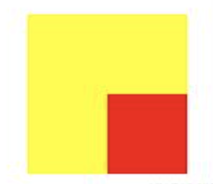

# CSS 基础

### 一. 初识 CSS

CSS 全称为 `cascading style sheet` 层叠样式表，它的主要作用是为 HTML 标签添加各种各样的样式和修饰效果

#### HTML 页面引入 CSS 的方式

- `行间样式`：直接写在 HTML 标签上的 style 属性
- `页面级 CSS`：在 head 标签里面添加 style 标签
  ```js
  <style type=”text/css”></style>
  ```
- `外联 CSS 文件`：在外创建一个以 `.css` 后缀的文件，在 `head` 标签里加上 `link` 标签引入
  ```js
  <link rel="stylesheet" href="...">
  ```
  - `link` 标签里的 `href` 属性写上 CSS 文件的地址，最好用`相对地址`的形式
    > link 加载不会阻塞 HTML 的加载，HTML 和 CSS 属于异步加载
  - **注意**：link 标签引入和 style 标签修改样式间没有什么优先级，**谁写在前面谁就先执行**，写在后面的 CSS 样式会覆盖前面的 CSS 样式
    > 有时 link 写在上面但 link 还没加载进来所以先运行了后面的 style，这种问题可能是网速导致的并不是二者本身拥有优先级的问题
- `import 方式引入(已经弃用)`：在 head 标签里写个 style 标签，在第一行写上 `@import url();，url`，里面写的是 CSS 文件的地址，可加引号也可不加引号，
  > 这种引入方式有几种缺点导致它现在被废弃使用：
  > - 必须写在第一行，若有多个则一起写在最前面
  > - IE6 的环境下只能使用最多 `31` 次 (这个数字据说是阿里的开发人员一点一点测试出来的(待考究))
  > - 程序读到 `import` 时会`忽略掉 import`，等 HTML 里包括图片在内的所有内容和资源全都加载完后才加载 import 的 CSS 文件，即 **import 引入的 CSS 文件和 HTML 的加载是同步进行的**

**`link` 和 `@import` 的区别**
- `link` 是 `XHTML` 标签，无兼容问题；`@import` 是在 `CSS2.1` 提出的，低版本的浏览器不支持
- `link` 是 `XHTML` 标签，除了加载 `CSS` 外还可以定义 `RSS` 事务、定义 `rel` 链接属性等；`@import` 属于 `CSS` 范畴，只能加载 `CSS`
- `link` 引用 `CSS` 时在页面载入时同时加载；`@import` 需要在页面完全载入后加载
- `link` 支持 JS 控制 DOM 去改变样式；`@import` 不支持
- `link` 的样式权重高于 `@import` 的权重

#### CSS 选择器

CSS 选择器的作用：找到想要修改样式的元素，然后为其修改样式

`id 选择器`：该 id 是唯一标识，一个元素只能有一个 id，一个 id 也只能给一个元素，然后在 CSS 文件中通过 `#id {}` 的方式选择到添加 id 的那个元素

`class 类选择器`：在元素的属性中写上 class 属性，该属性是为这个元素添加一个类名，每个元素可有多个类名，同一个类名也可赋给很多个元素，在 CSS 文件中通过 `.class {}` 的方式来选择出添加了类名的元素

`标签选择器`：如 `div {}`，只要是 div 的标签就会被选择出来

`通配符选择器`：`* {}`，所有的标签都会被选择出来，body 标签也包含在内

`父子选择器(派生选择器)`：
- 如 `div p {}`，给 div 下的 p 加样式，这时的 p 的权重值是`加和`的结果，id 和 class 也是可以使用父子选择器
  
- 在实际开发中因要**注意浏览器寻找元素时的耗能**，一般父子选择器建议不超过 `4` 层，如：`div p strong em span`，解读顺序是**从选择器的右边到左边读取路径链越短效率越高**，层级一般最好不超过四层，这是为什么呢？
  - 若是`从左往右`寻找，每找到一个父级标签都要把它下面所有标签都遍历一遍，看看有没有下一个标签，上面这个选择器示例中浏览器会先找到 div 标签，然后把 div 下面所有的子元素都遍历一遍后找到 strong 这个标签，然后再把 strong 标签下的所有元素遍历一遍找到 em 这个标签...以此类推，十分消耗性能且速度非常慢
  
  - 若`从右往左`，则浏览器只需先找到 span 标签，然后从 span 这个节点向上寻找，只要找到 em 就可以停止寻找...以此类推，不必遍历所有节点且需遍节点非常的少，这样的好处显而易见，速度非常快而且不耗性能

`直接子元素选择器`：如 `div > strong`
```js
// 正确
<div>
  <strong></strong>
</div>

// 错误
<div>
  <em>
    <strong></strong>
  </em>
</div>
```

`并列选择器`：可使用类似 `div.select {}` 来选择，这种方式是只有 div 和 .select 同时作用在一个标签上时才会被选出来，书写时标签名放在前面，其他的放在后面
```js
<div class=”select”></div>
```

`分组选择器`：如 `div, p, em, strong {}` 这样的写法，可以把这些标签都选出来加上同样的样式，中间是用逗号连接的

`伪类选择器`：
- 用于**当已有元素处于某个状态时为其添加对应的样式**，这个状态是根据用户行为而动态变化的，如当用户悬停在指定的元素时，可以通过 `:hover` 来描述这个元素的状态
  
- 虽然它和普通的 CSS 类相似，可以为已有的元素添加样式，但它**只有处于 DOM 树无法描述的状态下才能为元素添加样式**，所以将其称为`伪类`
  
- 常见的伪类
  - `:link`，设置 a 标签在未被访问前的 CSS 样式
  - `:visited`，设置 a 标签在其链接地址已被访问过的 CSS 样式
  - `:hover`，设置元素在其鼠标悬停时的 CSS 样式
  - `:active`，设置元素在被用户激活（在鼠标点击与释放间发生的事件）时的 CSS 样式
  


`伪元素选择器`：
- 用于**创建一些不在文档树中的元素并为其添加样式**，如可通过 `:before` 来在一个元素前增加一些文本并为这些文本添加样式

- 虽然用户可看到这些文本，但这些文本实际上不在`文档树`中（某些伪类或伪元素仍然处于试验阶段，在使用前建议先在 [Can I Use](https://caniuse.com/) 等网站查一查其浏览器兼容性）
  


`属性选择器`：属性选择器搭配较自由，既可根据属性来选也可根据属性值来选，还可根据部分属性值来选，具体规则如下
| 选择器 | 描述 |
| --- | --- |
| [attribute] | 用于选取带有指定属性的元素 |
| [attribute=value] | 用于选取带有指定属性和值的元素 |
| [attribute^=value] | 匹配属性值以指定值开头的每个元素 |
| [attribute$=value] | 匹配属性值以指定值结尾的每个元素 |
| [attribute*=value] | 匹配属性值中包含指定值的每个元素 |
| [attribute～=value] | 用于选取属性值中包含指定词汇的元素 |
| [attribute\|=value] | 用于选取带有以指定值开头的属性值的元素，该值必须是整个单词 |

> 注意：
> - 一般不给标签加 id，而是通过添加 class 类名来选择，因为 id 代表唯一标示（一般用 id 来做标记，后台的 php 会根据提取出来 id 换成他们的标记），因此可能会导致选择器选择不出来想要的标签
> - 写类名时一定要注意语义化，要符合语义化标准，要用英文单词去命名，而不是用 abc 之类的类名

#### 选择器的权重及优先级

`权重值`

- `!important`：无穷大（在数学中【无穷大+1】依然是无穷大，但在 CSS 选择器的权重值里【无穷大+1 > 无穷大】）
- `行间（内联）样式`：1000
- `id`：100
- `class、属性、伪类`：10
- `标签、伪元素`：1
- `通配符`：0

`优先级`

- 元素声明的样式权重高于浏览器的默认样式
- 浏览器默认样式的权重高于继承父级元素的样式
- !important > 内联 > ID 选择器 > 类选择器（属性、伪类） > 标签选择器（伪元素） > 通配符

#### 选择器的执行效率

选择器的执行效率（由高到低）：id(#myid) > 类(.myclassname) > 标签(div, h1, p) > 相邻(h1 + p) > 子元素(ul > li) > 后代(li a) > 通配符(*) > 属性(a[rel="external"]) > 伪类(a: hover, li: nth-child)

> CSS 选择器对性能的影响源于浏览器匹配选择器和文档元素所消耗的时间，所以优化选择器的原则是应尽量避免使用消耗更多匹配时间的选择器

#### 单位

`绝对单位`：
- 如：px、in、pt、cm、mm
  
- `px`：pixels（像素）的缩写，用于屏幕显示器上
  - 传统上一个像素对应屏幕上的一个点，而对于高清屏则更多
  - 任何现代显示屏都是由成千上万的像素组成，因此可以使用像素来定义长度
  - CSS 将光栅图像如照片等的显示方式定义为默认每个图像大小为 1px，一个 “600x400” 解析度的照片的长宽分别为 “600px” 和 “400px”，所以照片本身像素并不会与显示装置像素（可能非常小）一致，而是与单位 px 一致，如此就可以将图像完整的与网页其他元素排列起来

`相对单位`：
- 如：%、em、rem、vw、vh、vmin、vmax
  
- `%`：子元素的百分比相对的数值是父级里对应属性的值，如父级的高度是 100px，子级的 50% 就是 50px

- `em`：必须有个参照值，该参照值不是固定的
  - `font-size`：em 的计算方式是相对于`父元素`的字体大小，1em 等于父元素设置的字体大小，若父元素没有设置字体大小则继续往上查找，若都没有设置则使用浏览器默认的字体大小
  - `其他属性（border、width、height、padding、margin、line-height）`：em 的计算方式是参照`该元素`的字体大小，1em 等于该元素设置的字体大小，同理若该元素没有设置则一直向上查找，若都没有设置则使用浏览器默认的字体大小

- `rem`：
  - rem 的参照物是`固定`的，相对根元素 html 的 font-size 来计算
  - rem 的 r 指的是 root，是 CSS3 新加属性，有些浏览器不兼容，哪怕在移动端安卓 4.3 以下也是不兼容，不过长远来说这也是必备的
  
- `vw/vh/vmin/vmax`：
  - 基于视窗大小（浏览器用来显示内容的区域大小）来计算的
  - 网页中很多时候需要用到满屏或屏幕大小的一半等，尤其是移动端，屏幕大小各式各样，这四个就很适合
  - vw：基于视窗的宽度计算，1vw 等于视窗宽度的百分之一
  - vh：基于视窗的高度计算，1vh 等于视窗高度的百分之一
  - vmax：基于 vw 和 vh 中的最大值来计算，1vmin 等于最大值的百分之一
  - vmin：基于 vw 和 vh 中的最小值来计算，1vmin 等于最小值的百分之一

> Chrome 浏览器的最小字体是 12px，就算设置为 10px 也会渲染成 12px

### 二. 盒模型

#### 概念

当对一个文档进行`布局(layout)`时，浏览器的渲染引擎会根据标准之一的 CSS 基础框盒模型(CSS basic box model)，将每个元素都描述为一个个矩形的盒子(box)，这些盒子通过一个模型来描述其占用空间，CSS 决定这些盒子的大小、位置以及属性(例如颜色、背 景、边框尺寸...)

一个盒子由 4 个部分组成：`外边距（margin）`、`边框（border）`、`内边距（padding）`、`内容区（content）`
- `content` 不是由属性构成，是由写的内容、width 和 height 属性构成
  
- `margin` 设置是这个元素距离外面靠近它的元素或浏览器边框的距离，这是一个复合属性：margin-top、margin-right、margin-bottom、margin-left 组成，也可分开写设置每个属性的属性值，该复合值有 4 种写法
  - 4 个值：按照上、右、下、左的顺序
  - 3 个值：按照上、左右、下的顺序
  - 2 个值：按照上下、左右的顺序
  - 1 个值：四个方向是同个值

- `padding` 也是复合属性（参考 margin）

> 注意：body 元素有个默认的 `8px` 的 `margin`，同时还发现标签默认也有一些 margin
> 
> 因为这些样式可能对布局造成影响，一般需要去掉这些默认样式，在开发中一般使用 `*{} 通配符`选择器来初始化样式
> 
> 因为通配符的优先级最低，后面若想要加样式，随便一个样式设定都会高于通配符选择器，但若没有设置则浏览器就会将默认样式为设置的初始化样式


#### 盒子计算

CSS 的盒子模型有两种：
- 标准的 W3C 盒子模型模型
- 怪异（IE）盒子模型

`标准的 W3C 盒子模型`

在 W3C 标准下定义元素的 width 值即为盒模型中的 content 的宽度值，height 值即为盒模型中的 content 的高度值，因此标准盒模型下：
- width = content 的宽度
- height = content 的高度
- 盒子实际占位宽度 = width(内容宽度) + margin-left + border-left + padding-left + padding-right + border-right + margin-right
- 盒子实际占位高度 = height(内容高度) + margin-top + border-top + padding-top + padding-bottom + border-bottom + margin-bottom
  


`怪异盒子模型`

而 `IE` 怪异盒模型（IE8 以下），width 的宽度并不是 `content` 的宽度，而是 border-left + padding-left + content 的宽度值 + padding-right + border-right，`height` 同理
- width = border-left + padding-left + content 的宽度值 + padding-right + border-right
- height = border-left + padding-left + content 的高度值 + padding-right + border-right
- 盒子实际占位宽度 = margin-left + width + margin-right
- 盒子实际占位高度 = margin-top + height + margin-top


#### 盒模型的转换方式

现代浏览器默认使用 `W3C` 的标准盒模型，但有时可能也会需要怪异盒模型，则可使用 `W3C` 在 `CSS3` 中加入的 `box- sizing` 属性

```js
box-sizing: content-box // 标准盒模型，默认值
box-sizing: border-box // 怪异盒模型
```

> 注意：  
> - 只有 `firefox` 浏览器支持 `padding-box` 属性值  
> - `IE` 浏览器在 `getComputedStyle` 得到 `width/height` 是按照标准模式计算的，不管 `box-sizing` 的取值

### 三. 格式化上下文

默认情况下盒子按照元素在 `HTML` 中的先后位置从左至右自上而下一个接着一个排列摆放

不同的盒子使用的是不同的格式化上下文（formatting context）来布局，每个格式化上下文都拥有一套不同的渲染规则，它决定了其子元素将如何定位以及和其他元素的关系和相互作用

#### BFC - 块级格式化上下文（Block Format Context）

W3C 规范对 BFC 的定义：
- 浮动元素、绝对定位元素、非块级盒子的块级容器（如 inline-block、table-cells、table-captions）、overflow 值不为 visiable 的块级盒子，都会为它们的内容创建新的 BFC
  
- 在 BFC 中，盒子从顶端开始垂直地一个接一个地排列，两个盒子间的垂直的间隙是由它们的 `margin` 值决定，两个相邻的块级盒子的垂直 margin 会产生合并
  
- 在 BFC 中每个盒子的左外边缘 margin-left 会触碰到容器的左边缘border-left，相反则触碰到右边缘
  
`MDN 对 BFC 的定义`：块格式化上下文（Block Formatting Context，BFC）是 Web 页面可视化 CSS 渲染的一部分，是布局过程中生成块级盒子的区域，也是浮动元素与其他元素的交互限定区域

> 简而言之，`BFC` 是一块独立的渲染区域，让处于 BFC 内部的元素与外部的元素互相隔离
> - 该区域内所有元素的布局不会影响到区域外元素的布局
> - 它决定了其子元素将如何定位以及和其他元素的关系和相互作用
> - 这个渲染区域只对块级元素起作用

`BFC 渲染规则`：
- 块级盒会在垂直方向一个接一个地放置，每个盒子水平占满整个容器空间
  
- 块级盒的垂直方向距离由上下 `margin` 决定，同属于一个 `BFC` 中的两个或两个以上块级盒相接的 `margin` 会发生重叠（均为正值则取最值；一正一负则取相加后的值；均为负则取绝对值大的那个），不同 `BFC` 垂直方向 `margin` 不合并
  
- 计算 `BFC` 的高度时浮动元素也参与计算
  
`触发 BFC 的条件`：
- 根元素（`html` 元素）或包含根元素的元素
- 浮动元素（`float` 的属性不为 `none`）
- 绝对定位元素（`position` 为 `absolute` 或 `fixed`）
- `overflow` 值不为 `visible` 的块元素（`hidden`、`auto`、`scroll`）
- 行内块元素（元素的 `display` 为 `inline-block`）
- 表格单元格（元素的 `display` 为 `table-cell`，`HTML` 表格单元格默认为该值）
- 表格标题（元素的 `display` 为 `table-caption`，`HTML` 表格标题默认为该值）
- 弹性盒子元素（`display` 为 `flex` 或 `inline-flex`）
- 网格元素（`display` 为 `grid` 或 `inline-grid`）
- `display` 值为 `flow-root` 的元素
- `contain` 值为 `layout`、`content` 或 `strict` 的元素

> [块格式化上下文](https://developer.mozilla.org/zh-CN/docs/Web/Guide/CSS/Block_formatting_context)

`BFC 的作用`：
- `margin` 合并现象 
  
  如两个 div，分别给它们加上 margin-bottom 和 margin-top 为 10 px 的样式，这两个 div 上下之间的距离并不是相加的 20px，而是只有 10px！
  ```js
  <div class=”top”>top</div>
  <div class=”bottom”>bottom</div>
  ```

  解决：给每个 `div` 分别加上一个父级包裹层，然后给父级包裹层都加上 `overflow:hidden;`，通过`父 div` 来触发 `BFC` 就可以解决 `margin` 合并的问题

  ```js
  <div class=”wrapper”>
    <div class=”top”>top</div>
  </div>
  <div class=”wrapper”>
    <div class=”bottom”>bottom</div>
  </div>
  ```

- `margin` 塌陷现象
  
  当给如示例中的结构的两个 div 分别设置 margin-top 时，这个 bug 就会出现了
  ```js
  // css
  .wrapper {
    width: 100px;
    height: 100px;
    margin-top: 100px;
    margin-left: 100px;
    background-color:yellow;
  }
  .content {
    width: 50px;
    height: 50px;
    margin-top: 50px;
    margin-left: 50px;
    background-color: red;
  }

  // html
  <div class=”wrapper”>
    <div class=”content”></div>
  </div>
  ```

  这段代码的原意是想要一个 100 * 100 大小的父级 div，里面有一个 50 * 50 大小的子级 div，让这个 div 在父级 div 的右下角，同时父 div 距离浏览器的边框有 100px 的距离

  

  实际的结果是子级 div 的 margin-top 的效果并不是距离父级 div 50px，而是子级的 div 距离浏览器边框的距离是 50px，由于本身父级 div 有一个 margin-top 的值，所以就导致了子级的 margin-top 的效果并没有显现出来，再改变一下子级 div 的 margin-top 的值为 200px，子级 div 不仅没有距离父级 div 有一段距离，反而带动了父级 div 一起向下移动了！**这就是 `margin` 塌陷现象**

  

  解决：
  - `利用 border 来触发 BFC 的效果`：`margin 塌陷问题`很容易让人联想到子 div 之所以没有相对父级移动是因为看不到父级的边界，只能看到浏览器的边界，那给父级加一个子级能看到的边界这个问题是不是就解决了？
    > 在父级 `div.wrapper` 里添加个属性：`border-top: 1px solid red;`，content 和 wrapper 解除了绑定，子级 div 能看到父级的边界，但这样就会改变父级 div 的样式，不符合开发要求，因此这种方法虽然可以解决问题但是不适合
  
  - `利用 overflow 来触发 BFC 的效果`：在父级 div.wrapper 里加一条属性：`overflow: hidden;` 这条属性的意思是溢出隐藏，在外观没有改变的同时，子 div 和父 div 解除了绑定，能正常移动了！
    > 一般采用这种方式来解决 `margin` 塌陷的问题

    >  注意：虽然这种的方式可以采用，但其也有缺点。一旦用 JS 代码改变了子级 div 的位置，就会有可能导致子级一部分内容因为溢出被隐藏的风险

- 两栏布局，防止文字环绕等 
  ```js
  <div class='div1'></div>
  <div class='div2'></div>
  .div1 {
    float:left;
    height:400px;
    width:200px;
    border:2px solid red;
  }
  .div2 {
    height:400px;
    border:5px solid green;
  }
  ```

  

  触发 `BFC`
  ```js
  .div1 {
    float:left;
    height:400px;
    width:200px;
    border:2px solid red;
  }
  .div2 {
    height:400px;
    border:5px solid green;
    display:flex;
  }
  ```  
  

`BFC 与 hasLayout`

`*zomm: 1` 的属性，这是 `IE hack`，因为 `IE6 ~ 7` 并不支持 `W3C` 的 `BFC` ，而是使用私有属性 `hasLayout`

从表现上来说 `hasLayout` 跟 `BFC` 很相似，只是 `hasLayout` 自身存在很多问题，导致了 `IE6~7` 中一系列的 `bug` 

触发 `hasLayout` 的条件与触发 `BFC` 有些相似，推荐为元素设置 `IE` 特有的 `CSS` 属性 `zoom: 1` 来触发 `hasLayout`

`zoom` 用于设置或检索元素的缩放比例，值为`“1”`即使用元素的实际尺寸，使用 `zoom: 1` 既可以触发 `hasLayout` 又不会对元素造成其他影响，相对来说会更为方便

> 注意：既然 `hasLayout` 有着跟 `BFC` 相似的功能，在实际开发中就要为需要触发 `BFC` 的元素同时触发 `hasLayout` ，这样 `BFC` 和 `hasLayout` 具有的一些特殊性质可以在现代浏览器和 `IE` 中同时产生，避免一个元素在不同浏览器间的表现因为 `BFC` 或 `hasLayout` 出现差异
> 
> 事实上在实际开发中很多莫名其妙的问题其实都是因此而产生的，同样地若一个元素没有触发 `BFC` 也要尽量保证它没有触发 `hasLayout` 


> [深入理解 BFC](https://www.cnblogs.com/xiaohuochai/p/5248536.html)

#### IFC - 行内格式化上下文中（Inline Formatting Context）

相对于块格式化上下文，盒子是一个接一个地水平排列，起点是包含块的顶部，视觉上它将内容与其它行内级元素排列为一行，直到该行被占满然后换行

水平方向上的 `margin`、`border` 和 `padding` 在盒子之间得到保留

盒子在垂直方向上可以以不同的方式对齐：顶部或底部对齐，或根据其中文字的基线对齐

`行内级盒`分为：
- 行内盒(inline boxes)，由`非置换元素`且 `display` 值为 `inline` 的元素生成
  > 非替换元素如 a，span 等标签可设置水平方向上的 margin，但无法设置垂直方向的 margin，至于 border 和 padding，垂直方向可以设置但当 border-top 和 padding-top 到达页面顶部后就不再增加

- 原子行内级盒(atomic inline-level boxes)，由`行内级置换元素`或 `display` 值为 `inline-block`、`inline-table`、`inline-flex`
  > `替换元素`是指内容可以替换的元素，即 content box 可以被替换的元素，如存在 src="" 属性的 img、audio、video、iframe 元素和可以输入文本的 input、select、textarea 等表单元素等，可正常使用 margin、border、padding

`IFC 渲染规则`：
- 盒子一个接一个水平摆放，当容器宽度不够时就会换行
- 在水平方向上这些盒的 `margin`、`border`、`padding` 所占用的空间都会被计算，但行内盒的垂直的 `border`、`padding`、`margin` 都不会撑开行盒的高度
- 在垂直方向上，这些盒可能会以不同形式来对齐，可通过 `vertical-align `来设置，默认对齐为 `baseline`
- 每一行将生成一个行盒（`line box`），包括该行所有的盒子，行盒的宽度是由包含块和存在的浮动来决定
- 行盒一般左右边都贴紧其包含块，但会因为浮动盒（`float` 元素）的存在而发生变化。浮动盒会位于包含块边缘与行盒边缘之间，这样行盒的可用宽度就小于包含块的宽度
- 当所有盒的总宽度小于行盒的宽度，那么行盒中的水平方向排版由 `text-align` 属性来决定
- 当一个行内盒超过行盒的宽度时，它会被分割成多个盒，这些盒被分布在多个行盒里。若一个行内盒不能被分割（如只包含单个字符，或 `word-breaking` 机制被禁用，或该行内框受 `white-space` 属性值为 `nowrap` 或 `pre` 的影响），则这个行内盒将溢出这个行盒
- 当一个行内盒发生分割时，分割处的 `margin`、`border`、 `padding` 不会有任何视觉效果（或其他任何分裂，只要是有多个行盒）
- 行盒的高度由内部元素中实际高度最高的元素计算出来，每个行盒的高度由于内容不一样，所以高度也可能不一样
- 在一个行盒中，当包含的内部容器的高度小于行盒的高度时，内部容器的垂直位置可由自己的 `vertical-align` 属性来确定

> 注：在 IFC 的环境中是不能存在块级元素的，若将块级元素插入到 IFC 中，则此 IFC 将会被破坏掉变成 BFC，而块级元素前的元素或文本和块级元素后的元素或文本将会各自自动产生一个匿名块盒将其包围

### 四. 定位

`CSS` 中元素的层次模型主要是由 `position` 属性来决定的。`position` 的意思是`定位`，该属性的作用就是给元素施加定位

- `static`：默认属性。当没有设置 `position` 属性时元素默认的定位就是 `static` 定位，元素出现在正常的流中，此时 `top`、`right`、`bottom`、`left` 和 `z-index` 属性无效

- `relative`：相对定位。此时的`相对`是相对于其在正常文档流的位置进行定位  
  - 当 `position` 设置为 `relative` 后 `left`、`top`、`right`、`bottom` 进行的定位就会变成相对于自身的位置进行移动
  - **`relative` 的参照物是元素自身**
  - 当仅给元素设置 `position:relative` 并没有设置 `left`、`right`、`top`、`bottom` 属性时，元素的定位是没有发生任何改变的
    > **因为这个特性，一般在开发中 `relative` 是用作设置参照物的**，一个 `absolute` 元素要相对于某个元素进行移动就可以给那个参照元素设置 `relative`

- `absolute`：绝对定位。它会使元素脱离本来的位置再进行定位，它会使元素像立交桥一样出现空间上的分层
  - 当元素脱离原来的位置后其他的元素就会`看不到`这个元素，同时 `absolute` 也可以触发 `BFC`
  - **`absolute` 的参照物是距离它最近的有定位（除了 `static`）的父级，当每个父级都没有定位时元素会相对于浏览器边框进行定位**
  - 当使用绝对定位后可以使用 `left`、`right`、`top`、`bottom` 这四个属性分别设置当前元素距离`左边`、`右边`、`上边`和`下边`的距离，一般是两两一对出现，如：`left` 和 `top`、`right` 和 `bottom`

- `fixed`：固定定位。`fixed` 定位是相对于视口的定位，网页上下左右两边不随着滚动而改变位置的广告栏，一般就是用 `fixed`

- `sticky`：粘性定位。特性近似于 `relative` 和 `fixed` 的合体，其在实际应用中的近似效果就是 `IOS` 通讯录滚动时 『顶屁股』
  > https://codepen.io/xiaomuzhu/pen/bPVNxj/

### 五. z-index

`z-index` 属性用于指定`已定位元素`在垂直于页面方向的排列顺序，其属性值有  `2` 种：`auto（默认值）` 和 `整数`

`z-index` 属性只对`定位元素`生效，即 `position` 属性不为 `static` 的元素

除了默认值 `auto`，`z-index` 可以设置为任意整数：`正数`、`0`、`负数`

一般情况下，`z-index` 值进行比较有下面 `2` 条规则：
- 数值大的在上面，`auto` 数值上相当于 `0`
- 数值相同的在 `HTML` 结构中排后面的在上面

> `z-index` 默认值 `auto` 数值上相当于 `0`，但 `z-index: 0;` 和默认的  `z-index: auto;` 是有区别的：
> - 设置 `z-index` 属性为整数值包括 `0` 的元素，自身会创建一个`层叠上下文`
> - 而创建一个层叠上下文后其子元素的层叠顺序就相对于父元素计算，不会与外部元素比较

在进行 `z-index` 比较时要留意其祖先元素有没有建立独立的层叠上下文，**z-index 只有在`同个层叠上下文`中比较才有意义**

可以把视图上的元素认为是一摞书的层叠，而人眼是俯视的视⻆，设置 `z-index` 的位置就如同设置某一本书在这摞书中的位置
```js
顶部: 最接近观察者 
...
3层
2层
1层
0 层 默认层 
-1 层
-2 层
-3 层 
...
底层: 距离观察者最远
```

### 六. 层叠上下文和层叠顺序

#### 层叠上下文

一般情况下，元素在页面上沿 `X 轴`、`Y 轴`平铺，察觉不到它们在 `Z 轴`上的层叠关系，而一旦元素发生堆叠，这时就能发现某个元素可能覆盖了另个元素或被另个元素覆盖，`HTML` 元素依据其自身属性按照优先级顺序占用层叠上下文的空间

若一个元素含有`层叠上下文(即它是层叠上下文元素)`，可以理解为这个元素在 `Z 轴`（表示的是用户相对于面向(电脑屏幕的)视窗或网⻚的这条看不见的垂直线）上就“高人一等”，最终表现就是它离屏幕观察者更近

`特性`：
- 层叠上下文的层叠水平要比普通元素高
- 层叠上下文可以阻断元素的混合模式
- 层叠上下文可以嵌套，内部层叠上下文及其所有子元素均受制于外部的层叠上下文
- 每个层叠上下文和兄弟元素独立，即当进行层叠变化或渲染时只需要考虑后代元素
- 每个层叠上下文是自成体系的，当元素发生层叠时整个元素被认为是在父层叠上下文的层叠顺序中

`产生条件`：
- `HTML` 中的根元素 `<html></html>` 本身就具有层叠上下文，称为`根层叠上下文`
- **普通元素设置 `position` 属性为非 `static` 值并设置 `z-index` 属性为具体数值（非 `auto`），产生层叠上下文**
- 一个 `z-index` 值不为 `auto` 的 `flex` 项目 (flex item)，即：父元素 `display: flex | inline-flex`
- `opacity` 属性值`小于 1` 的元素(参考 the specification for opacity)
- `transform` 属性值不为 `none` 的元素
- `mix-blend-mode` 属性值不为 `normal` 的元素
- `filter` 值不为 `none` 的元素
- `perspective` 值不为 `none` 的元素
- `isolation` 属性被设置为 `isolate` 的元素
- 在 `will-change` 中指定了任意 `CSS` 属性，即便没有直接指定这些属性，关于 `will-change` 可以参见该文章：[使用CSS3 will-change提高页面滚动、动画等渲染性能](https://www.zhangxinxu.com/wordpress/2015/11/css3-will-change-improve-paint/)
- `-webkit-overflow-scrolling` 属性被设置 `touch` 的元素

#### 层叠水平/等级（stacking level）

在`同个`层叠上下文中元素在 `Z` 轴上的显示顺序，普通元素的层叠水平优先由层叠上下文决定，因此层叠水平的比较只有在当前层叠上下文元素中才有意义

在其他普通元素中，它描述定义的是这些普通元素在 `Z` 轴上的上下顺序

#### 层叠顺序

`层叠顺序`表示元素发生层叠时按照`特定顺序规则`在 `Z` 轴上垂直显示，因此上面所说的`层叠上下文`和`层叠等级`是一种`概念`，而`层叠顺序`是一种`规则`

在不考虑 `CSS3` 的情况下当元素发生层叠时层叠顺序遵循下面的规则，这里值得注意的是：
- 层叠上下文 `background/border` 指的是层叠上下文元素的背景和边框，每个层叠顺序规则适用于一个完整的层叠上下文元素
- 原图没有呈现 `inline-block` 的层叠顺序，实际上 `inline-block` 和 `inline` 水平元素是同等 `level` 级别
- `z-index: 0` 实际上和 `z-index: auto` 单纯从层叠水平上看是可以看成是一样的，实际上两者在层叠上下文领域有着根本性的差异
  
> 为什么`内联元素`的层叠顺序要比`浮动元素`和`块状元素`都高？
> - 因为 `border/background` 等一般为装饰属性，`浮动和块状元素`一般用作布局，而`内联元素`一般都是页面内容，网页中最重要的当然是内容
> - 因此一定要让内容的层叠顺序相当高，当发生层叠时重要的文字、图片内容可以优先暴露在屏幕上 


#### 总结

- 首先先看要比较的两个元素是否处于**同一个层叠上下文中**，若是则谁的层叠等级大，谁在上面
- 若两个元素不在同一层叠上下文中，先比较它们所处的层叠上下文的层叠等级
- 当两个元素层叠等级相同、层叠顺序相同时，在 DOM 结构中后面的元素层叠等级在前面元素之上

> [层叠上下文-张鑫旭](https://www.zhangxinxu.com/wordpress/2016/01/understand-css-stacking-context-order-z-index/)

### 七. 浮动

`float` 属性可让元素像站队一样浮动起来，它会让本来占满整行的元素只按照内容和设置大小来在`父级`里面进行站队排列
- 当这一行剩余的空间不足以再放下这个元素时元素就会自动换行到下一行去进行浮动排列
- 当容器不够大时虽然内容会超出容器范围，但超出后仍然是按照相同队形来进行站队

浮动起来的元素会像 `absolute` 的元素脱离文档流，但**不会脱离文字流**，这是什么意思呢？
- 脱离文档流的意思就是正常元素看不到它，不脱离文字流的意思则是 `display` 属性是 `inline` 或 `inline-block` 的元素还是可以看到它的
  > 文字本身是 `inline` 属性

`float` 属性只有两个值：`left`、`right`，默认状态是 `none`

`float 属性的作用`：
- 对元素进行布局
- 像 `absolute` 一样让元素浮动起来，产生自己独有的浮动流

`浮动流有两个效果`：
- 脱离标准的文档流但不会脱离文字流 ，正常元素看不到它，但有文字属性 `inline` 或文字本身可以看到它
- `float` 属性会自动将这个元素的 `display` 改成 `inline-block`，即不论给 `display` 加上什么值，只要有 `float` 属性，那这个元素就是 `inline-block` 属性

`使用 float 场景`：
- 一般是使用`网状布局`时使用，当不知道容器里面会盛放多少个子元素，且这些子元素又是按照一样格式进行排列，可设置浮动来进行流式布局  
  

- 实现像报纸那样文字包围在图片四周的效果
  

`浮动元素会引起的问题`：
- 父元素的高度无法被撑开，影响与父元素同级的元素
- 与浮动元素同级的非浮动元素会跟随其后
- 若非第一个元素浮动，则该元素之前的元素也需要浮动，否则会影响页面显示的结构

`清除浮动：`

清除浮动主要是为了解决由于浮动元素脱离文档流导致的 `元素重叠`、`父元素高度坍塌` 的问题，而这两问题分别对应了需要清除浮动的两种情况：`清除前面兄弟元素浮动` 和 `闭合子元素浮动（解决父元素高度坍塌）`

- 清除前面兄弟元素浮动
  - 只需在不想受到浮动元素影响的元素上使用 `clear: both` 即可
  - 在 `CSS2` 以前 `clear` 的原理为自动增加元素的上外边距 `margin-top` 值，使之最后落在浮动元素的下面
  - 在 `CSS2.1` 中引入了一个`清除区域（clearance）`：在元素外边距之上增加额外间距，使之最后落在浮动元素的下面，所以若需要设置浮动元素与 `clear` 元素的间距，得设置浮动元素的 `margin-bottom`，而不是 `clear` 元素的 `margin-top`

- 闭合子元素浮动
  > 父元素高度坍塌问题：在计算页面排版时，若没设置父元素的高度，则该父元素的高度是由他的子元素高度撑开的，但若子元素是设置了浮动导致脱离文档流，那父元素计算高度时就会忽略该子元素，甚至当所有子元素都是浮动时就会出现父元素高度为 `0` 的情况

  解决办法：
  - 在父级里内容区最后加个 `p (div 等)` 标签，给该标签增加清除浮动的样式  
    - 实际上并不是父级清除了浮动流，而是被 p 标签撑开了，p.clear 能看到上面浮动的元素，wrapper 能看到不浮动的 p 标签，因此把 p 标签包裹进去了 
    - 虽然该办法比较直观，但不是很优雅，因为增加了一个无用的空白标签，比较冗余且不方便后期维护（一般不太建议使用该办法）
    ```js
    // css
    .clear {
      clear: both;
    }

    <div class=”wrapper”>
      <div class=”content”>1</div>
      <div class=”content”>2</div>
      <div class=”content”>3</div>
      <div class=”content”>4</div>
      <p class=”clear”></p>
    </div>
    ``` 

  - `添加伪元素`。为父级元素添加一个 `after` 伪元素，让这个伪元素专门实现清除浮动的功能
    - 
    ```js
    .wrapper::after {
        content: "";
        clear: both;
        display: block; // 能清除浮动的元素，必须是块级元素
    }
    ```
    - 伪元素是一种不能单独存在的元素，它必须依附于其他正式元素标签上使用，单独写是没有任何意义的，伪元素最常用的有两个 `after`、`before`，当不想改变 `html` 结构又想要增添一些东西时，伪元素 `after`、`before` 就非常实用   
    - 注意使用伪元素时即使内容为空的也要加上 `content` 这个属性 `content: "";` 
    - 既然是伪元素那自然也属于元素，可设置伪元素的 `display` 为 `block`，从而可改变宽高等块级元素才有的样式
  
  - 触发 `BFC` 的方式来清除浮动（触发方式请见本文相关 BFC 部分内容）
  
- 注意：
  - `IE6/IE7` 并没有伪元素这种东西，但其独有 `hasLayout`，只要触发了 `hasLayout` 就和触发 `BFC` 有差不多的作用，能够触发这个东西的属性有很多，其中最无害的是 `zoom` 属性，只要写上这个属性 `IE6/IE7` 也可清除浮动
  - 不过其他浏览器并不需 `zoom` 属性，该属性只是为了 `IE6/IE7` 准备的，所以需要一点点 `CSS hack`，在 `zoom` 前加一个符号 `**zoom: 1;`，该符号只有 `IE6/IE7` 能够识别；属性前面加上`_`后就只有 `IE6` 可以识别 `_zoom: 1;`
  ```js
  .wrapper {
    zoom: 1; // 视口同比例放大还是缩小，1 就是不变
  }
  ```

### 八. CSS3

`CSS3` 是 `CSS2` 的升级版本
- 3 只是版本号，它在 CSS2.1 的基础上增加了很多强大的新功能
- 目前主流浏览器 chrome、safari、firefox、opera 甚至 360 都已经支持了 CSS3 大部分功能，IE10 以后也开始全面支持 CSS3

`CSS3 前缀：`
- 在编写 CSS3 样式时不同浏览器可能需要不同的前缀，它表示该 CSS 属性或规则尚未成为 W3C 标准的一部分，是浏览器的私有属性
- 虽然目前较新版本的浏览器都是不需要前缀的，但为了更好的向前兼容前缀还是少不了的，标准写法如表

| 前缀 | 浏览器 |
| --- | --- |
| -webkit | chrome/safari |
| -moz | firefox |
| -ms | IE |
| -o | opera |

`CSS3 功能：`
- 提供了更加强大且精准的选择器，提供多种背景填充方案
- 可实现渐变颜色，可改变元素的形状、角度等
- 可以加阴影效果、报纸布局、弹性盒子、IE6 混杂模式的盒模型、新的计量单位、动画效果等...
- 但 CSS3 的兼容性问题同样也显得格外重要，并不是所有 CSS3 属性都通过了 W3C 标准，需要全面的[兼容性查阅手册](https://www.runoob.com/cssref/css3-browsersupport.html)

> 详细可阅读 [CSS3 教程](https://www.runoob.com/css3/css3-tutorial.html)

### 九. 问题扩展

#### 有哪些方式（CSS）可以隐藏⻚面元素?

- `display: none`：自身及所有的子元素都彻底隐藏，好像不存在，既不占据空间也不可交互
  
- `visibility: hidden`：元素的大小不变，仍占据空间，可理解为透明，不可交互，但子元素设置为 visibility：visible 则该子元素依然可见

- `overflow: none`：规定了当内容元素溢出父容器时隐藏元素溢出的部分，使用滚动条来显示或直接显示超出部分，占据空间且不可交互
  
- `z-index: -9999`：原理是将层级放到底部，这样就被其他层级元素覆盖，看起来隐藏了
  
- `opacity: 0`：本质上是将元素的透明度设为 0，看起来隐藏了，但依然占据空间且可交互
  
- `transform: scale(0, 0)`：平面变换，将元素缩放为 0，占据空间但不可交互
  
- 还有一些靠绝对定位把元素移到可视区域外或用 clip-path 进行裁剪的操作等

#### 水平间距问题

在写页面的导航时，一般需要将 display 属性设置为 inline-block，此时会导致在两个导航元素间出现大约 `8px` 左右的空白间隙

```js
// css
.nav {
  background: 999;
}
.nav-item {
  display: inline-block;
  width: 100px;
  background: #ddd;
}

<div>
  <div class="nav-item"><a>导航</a></div>
  <div class="nav-item"><a>导航</a></div>
  <div class="nav-item"><a>导航</a></div>
</div>
```

原因是因为编写代码时输入`空格`、`换行`都会产生`空白符`，而浏览器是不会忽略空白符的且对于多个连续的空白符浏览器会自动将其合并成一个，故产生了所谓的间隙


解决方案：
- 代码不换行。由于换行空格导致产生换行符，因此可将上述例子中的列表 item 写成一行，这样空白符便消失，间隙就不复存在。但考虑到代码可读及维护性，一般不建议连成一行的写法
  ```js
  <div class="nav">
    <div class="nav-item">导航</div><div class="nav-item">导航</div><div class="nav-item">导航</div>
  </div>
  ```

- 设置 `font-size`
  
  首先空白符归根结底是个字符，因此可通过设置 `font-size` 属性来控制产生的间隙的大小，若将 `font-size` 设置为 `0`，文字字符是没法显示的，同样这个空白字符也没了，间隙也就没了

  通过`设置父元素的 font-size: 0` 来去掉这个间隙，然后`重置子元素的 font-size`，让其恢复子元素文字字符。使用该方法时需要特别注意其子元素一定要重置 font-size，不然很容易掉进坑里（文字显示不出来）
  ```js
  .nav {
    background: #999;
    font-size: 0; /* 空白字符大小为 0 */
  }
  .nav-item {
    display:inline-block;
    width: 100px;
    font-size: 16px; /* 重置 font-size 为 16px*/
    background: #ddd;
  }
  ```

  本来以为上面能够完全解决问题，但经测试将父级标签字符设置为 0 在 `Safari` 浏览器依然出现间隔空白。既然设置字符大小为 0 不行，那就将间隔消除，将下面代码替换上面的代码，目前测试完美解决。同样问题是 item 内的字符间隔也被设置了，需要将其内的字符间隔设为默认
  ```js
  .nav { letter-spacing: -5px; }
  .nav-item { letter-spacing: normal; }
  ```

#### 溢出打点

当文字超过所规定的范围后后面的全部文字就会变成 `…` 的形式来出现

`单行文字溢出打点，需要三个属性来配合使用：`
- `overflow: hidden`：实现让文字溢出容器的部分隐藏起来，方便后面的打点功能
- `text-overflow: ellipsis`：指文字溢出后怎么处理，ellipsis 是指处理方式是以点状显示
- `white-space: nowrap`：让文字不换行(文字的默认状态是换行的，当到达容器壁后自动换到下一行)，该属性让文字一直在一行显示，即使到了容器壁也不换行

`多行文字溢出打点：`
- 虽然有属性可达到多行文字溢出打点的功能，但兼容性不太好，除移动端的网页（因为移动端的浏览器一般版本都比较高）之外
- pc 端的网页一般都是用其他方式来实现，如：百度是通过计算文字的宽高，然后在最后手写 … 来实现多行文字溢出打点效果
- 而若想要以属性方式来完成多行文字溢出打点的功能，要用到以下属性：
  - `line-clamp` 属性是指让文字显示几行
    > -webkit 是兼容 webkit 内核的浏览器，目前还有很多浏览器不支持 line-clamp 属性
  - `box-orient` 也是非常勉强，因此该功能虽然存在，但由于兼容性问题很少有公司会使用
  - `display: -webkit-box` 是 CSS3.0 的一个属性
  ```js
  text-overflow: ellipsis;
  overflow: hidden;
  display: -webkit-box;
  -webkit-line-clamp: 3; //行数
  -webkit-box-orient: vertical;  
  ```

#### 如何让背景图片出不来时显示文字

有时网页会被用户禁止加载图片和 CSS 样式，若没有给背景图片设置任何信息，那用户就完全不知道这个空白地方是什么东西，所以要让图片加载不出来时也能够有文字展示出来，可以使用以下两种方法来实现这种效果

- `text-indent`：比较传统的做法是利用 `text-indent` 配合 `white-space: nowrap`、`overflow: hidden` 让元素内部的文字在有 CSS 时会被缩进到元素外面并被隐藏起来，当 CSS 不能加载时文字不会被缩进，所以可以展示出来

- `背景图片放到 padding 里，高度强制为 0`：background-image 是可以放到 padding 里，元素本身的高度为 0，利用 `padding-top` 撑起元素的内容区，这样当有 CSS 样式时配合 `overflow: hidden` 一起使用就可以让文字隐藏，没有 CSS 样式时文字就会正常显示出来
  ```js
  .taobao-head .header .logo-bd {
    display: block;
    margin-left: 22px;
    width: 142px;
    padding-top: 58px;
    height: 0;
    overflow: hidden;
    background: url(xxxx) 0 0 no-repeat;
  }
  ```

#### 为什么有时用 translate 来改变位置而不是定位?

translate 是 transform 的一个值，改变 transform 或 opacity 不会触发浏览器重新布局 reflow 或重绘 repaint，只会触发复合 compositions，而改变绝对定位会触发重新布局，进而触发重绘和复合

`transform` 使浏览器为元素创建一个 `GPU` 图层，但改变绝对定位会使用到 `CPU`，因此 translate 更高效，可以缩短平滑动画的绘制时间，且 translate 改变位置时元素依然会占据其原始空间，绝对定位就不会发生这种情况


