# 理解 line-height

### 概念

`line-height(行高)`：指一行文字的高度，具体来说是指两行文字间基线间的距离，如下图中两条红线间的距离就是行高 `line-height`（`vertical-align` 中有 `top、middle、baseline、bottom`，与之是有关联的）

同一行的顶线到底线的距离是`内容区域高度`，内容区域的高度只与字体和字号有关，在有的字体中(如 simsun 等)字体大小等于内容区域高度

上一行的底线和下一行的顶线的距离是`行间距`，可以看出`行高 = 内容高度 + 行间距`
> 当改变 `line-height` 值时，内容高度是不变的，**改变的只是行间距**，从而改变了行高

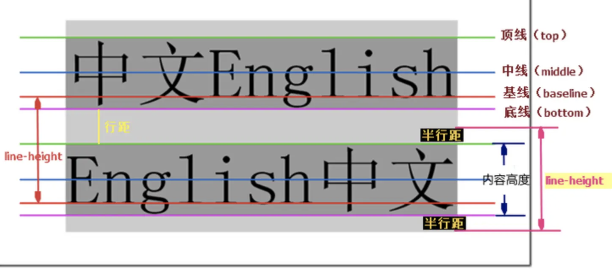

当半行距为负值（`line-height < font-size`）时两行间就会重叠，如下图所示：

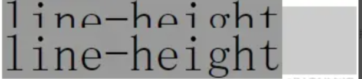

### line-height 与 line boxes 的高度

`CSS` 中起高度作用是：`height、line-height`，若一个标签没有定义 `height` 属性(包括百分比高度)，那其最终表现的高度一定是由 `line-height` 起作用，即使是 `IE6` 下 11 像素左右默认高度 bug 也是如此

假设有个空的 `div`，若没有设置至少大于 1 像素高度 `height` 值时，该 div 的高度就是个 `0`，若该 div 里打入一个`空格或文字`，则此 div 就会有个高度，此处根本不是文字撑开了 div 高度，而是 `line-height`

```js
// test1 div 有文字大小但行高为 0，结果 div 的高度就是个 0
// test2 div 文字大小为 0，但有行高为 20 像素，结果 div 高度就是 20 像素，这就说明撑开 div 高度的是 line-height 不是文字内容
<div class="test1">测试</div>
<div class="test2">测试</div>
.test1 {
  font-size: 20px;
  line-height: 0;
  border: 1px solid #cccccc;
  background: #eeeeee;
}
.test2 {
  font-size: 0;
  line-height: 20px;
  border: 1px solid #cccccc;
  background: #eeeeee;
}
```

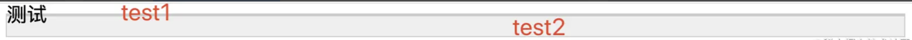

### 行内盒模型

`line box（行框）`是指本行的一个虚拟的矩形框，由该行中行内框组成。每行文字都是一个行框，当有多行内容时每一行都有自己的行框。行框的高度是这一行行内框的最高点到最低点的距离。行框由上间距、文本高度、下间距组成，上间距的距离与下间距的距离是相等的

> 一个没有设置 `height` 属性的 div 的高度就是由一个一个 `line boxes` 的高度堆积而成的

`inline box (行内框) `：行框下的每个标签（包括文字、图片、span 之类的 inline 属性的标签）都是一个单独的行内框，**行内框的高度等于 `font-size`**，设定 `line-height` 时行内框的高度不变，**改变的是行间距**

`包含盒子 containing box`：元素中行框的高度垂直叠加形成包含盒子的高度，即**元素的高度**

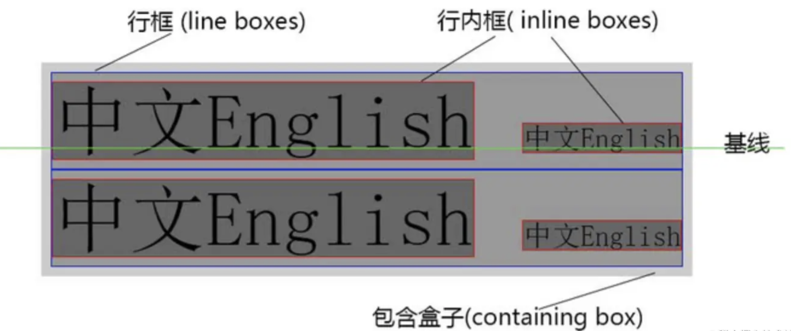

`content area`：
- 对于**非替换元素**，content area 的范围**由 `font-size` 及字体本身决定**
- 对于**替换元素**，由元素自有宽高决定

> W3C 对  content area 的解释：CSS 2.1 does not define what the content area of an inline box is (see 10.6.1 above) and thus different UAs may draw the backgrounds and borders in different places.

**有种说法是行框的高度等于这一行中行内框中最大的 `line-height`，这种说法是错误的**。下面代码中的 div 中的行内框最大的行高是 50px，但由于这个行内框存在 vertical-align 偏差，所以这个行框的高度大于 50  像素，即**行框的高度是这一行行内框的最高点到最低点的距离**

```js
<div style="line-height:30px">
  行内框1,行高30px<span style="line-height:50px;background:yellow;vertical-align:-20px">行内框2,行高50px</span>        
</div>
```
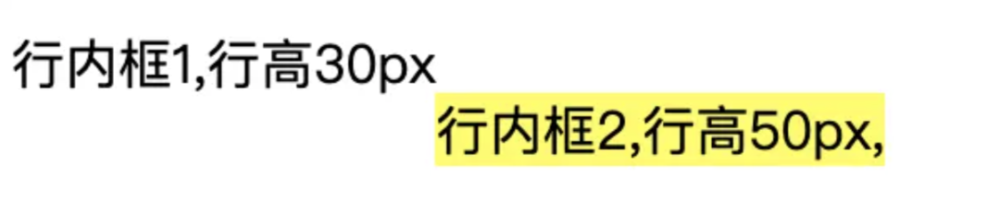

### line box 高度

浏览器会计算 line box 中每一个 inline box 的高度，对于不同的 inline box 计算方式有所不同

- 若是一个`替换元素（如 img、input 等）`、`inline-* 元素`或是 `flexbox 中的子元素`，**高度由其 `margin box` 决定**
  
  `inline-block 元素`：这里 `span inline box` 的高度是 `height + margin * 2`；若 `height` 的值是 `auto`，则高度就是等于 `line-height + margin * 2`

  ```js
  div {
    background-color: #ccc;
    color: #fff;
  }
  span {
    display: inline-block;
    height: 30px;
    margin: 10px;
    background: #fff;
    color: red;
  }
  <div>xxx<span>xxx</span>xxx</div>
  ```
  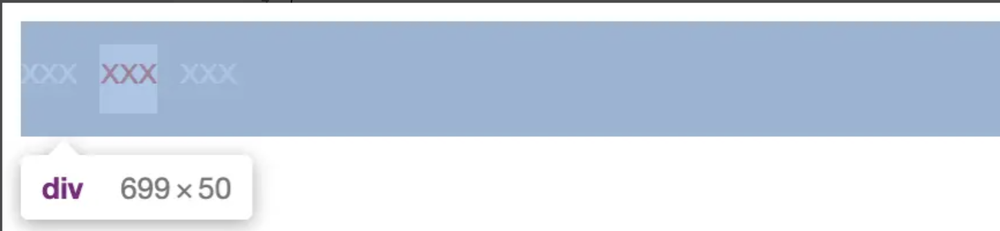

- `非替换元素`：高度由它的 `line-height` 决定，而不是 `content area`，虽然有时候看起来像 content area 撑开了 line box 的高度
  ```js
  div {
    background-color: #ccc;
    font-size: 20px;
    color: #fff;
    font-family: Sana;
  }
  span {
    background: #fff;
    color: red;
  }
  <div>xxx<span>xxx</span>xxx</div>
  ```

  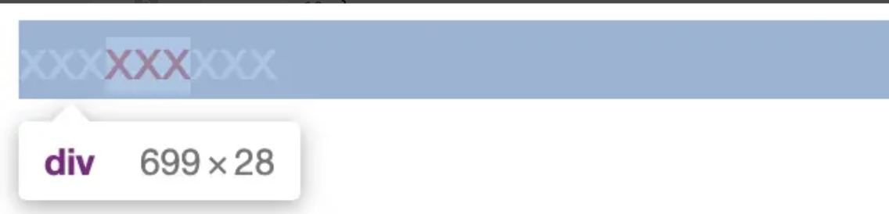

- `line box` 中所有 inline box 的最高点以及最低点决定了它的高度（该计算包括了 `strut` 的高度）
  
  - 浏览器认为每一个 line box 的起始位置都存在一个**宽度为 0、没有任何字符的匿名 inline box**，称为 `strut`
    > `strut` 会从父元素继承 `line-height`，因此它的高度会影响整个 `line box` 高度的计算
  
  - 在图片中可看到 `img` 与外层的 `div` 存在一个间隙，这就是 `strut` 造成的
    
    ```js
    div {
      background: #eee; 
      border: 1px solid #000; 
      box-sizing: border-box; 
    }
    <div>
      
    </div>
    ```

    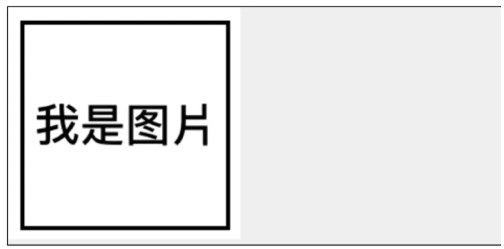

    在这个例子中，默认情况下 img 的底边与父元素的`基线`对齐（`img { vertical-align: baseline }`），而这个基线实际上就是 `strut` 基线所在的位置，如下图所示：

    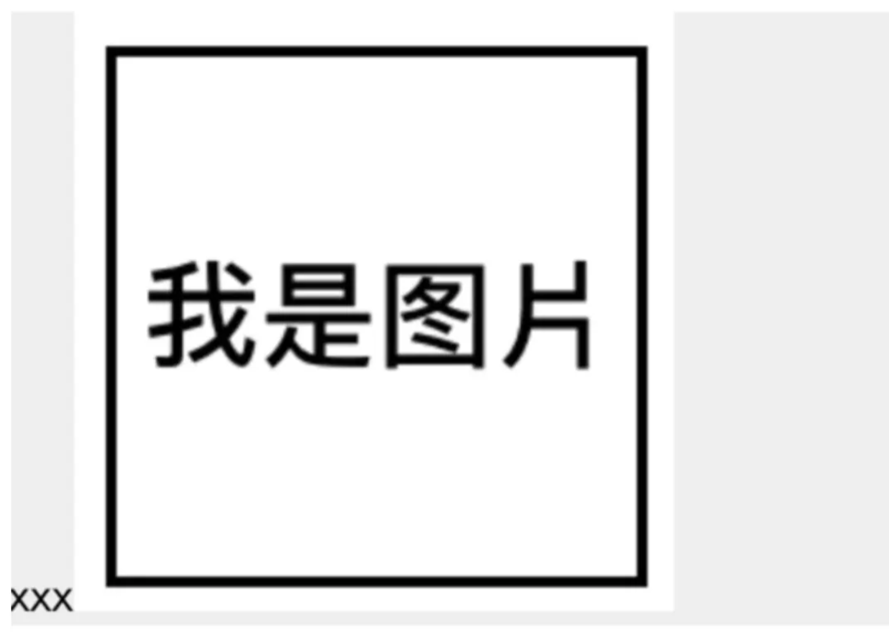
  
  - `strut` 就相当于一个不可见的字母 `x`，上文已提到 **`strut` 本身是具有 `line-height` 的**，所以导致图片底部多了一段间隙
  
  - **总结一下存在间隙原因：**
    > (1) `strut` 存在 `line-height`  
    > (2) `vertical-align` 默认值为 `baseline`

  - 对应的解决方案：
    > - (1) 修改 `strut` 的 `line-height`，因为 strut 的 line-height 不是能够直接设置的，所以需要**设置父元素的 `line-height`**，然后让 `strut` 继承，或修改 `font-size`
    > - (2) 将图片的 `vertical-align` 设置为其他值
    > - (3) 将图片的 `display 设为 block`，因为**块元素没有 vertical-align 属性，不存在基线对齐**
    > - 1 和 3 会影响父元素内的文字状态，所以第二种办法比较好

- 非替换元素的 `margin`、`padding` 及 `border` 并不会影响 line box 高度的计算
  
  当一个 inline-level box 的 line-height 小于 content area 时 line box 的高度就会小于 content area，此时元素的 background 以及 padding 等就会溢出到 line box 外

  ```js
  div {
    background: #eee;
    border: 1px solid #000;
    box-sizing: border-box;
    font-size: 50px;
    line-height: 10px;
  }
  span {
    background: red;
    margin: 10px;
    padding: 10px;
  }
  <div><span>xxx</span></div>
  ```

  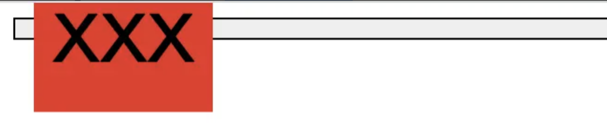

### line-height 取值和继承

**`normal`：默认值**

- 一般情况下浏览器默认的 `line-height` 为 `1.2`，因不同浏览器和字体变化，**根据自身字体大小进行计算**，其子元素不再继承父元素 line-height 计算后的最终值，而是先继承 line-height 这个属性然后根据自身的 `font-size` 来进行计算
  > 可见子元素随着自身 font-size 的大小而做相应比例的缩放

  | element | font-size | line-height | 计算后的 line-height |
  | ----- | -----| ----- | ----- |
  | body | 16px | normal | 16 * 1.2 = 19.2px |
  | h1 | 32px | normal | 32 * 1.2 = 38.4px |

**`number`：若既想要 `normal` 的灵活又想设置一个自定义的值，就需给 `line-height` 设置一个数字值**

- 该方式与 normal 唯一的不同：`数值的大小`，可以自己随意设定（而 normal 的值是浏览器决定的），其后代元素会继承这个数值（如 1.5），然后根据自身的 font-size 算出自身的 line-height

  | element | font-size | line-height | 计算后的 line-height |
  | ----- | -----| ----- | ----- |
  | body | 16px | 1.5 | 16 * 1.5 = 24px |
  | h1 | 32px | 1.5 | 32 * 1.5 = 48px |

**`inherit`：继承父元素 line-height 值**

- 父元素的是多少就是多少，若其后代元素设置 `line-height` 的话也会是这个值

**`length`：设置固定的行间距**

- 设置 line-height 为 20px，则该行的该行高就是 20px，与 font-size 无关，不会随着 font-size 做相应比例的缩放
- 这个长度值（20px）会被后代元素继承，所有的后代元素会使用这个 line-height (20px)，除非后代元素自己设定 line-height
  
**百分比 `%`**

- 假设自身的 font-size 为 16px，line-height 设为 120%，则其行高为 16 * 120% = 19.2px，即 line-height 是**根据自身的 font-size 计算出来的**
- 子元素会继承父元素的 line-height，则它继承的是百分比 120% 还是 19.2 px？答案是 19.2px，即**父元素 line-height 计算后的最终值**

**总结如下：**

| 设置方式 | line-height | 计算后的 line-height | 子元素继承的 line-height |
| ----- | -----| ----- | ----- |
| inherit | 父元素的 line-height | 不用计算 | 父元素的 line-height |
| length | 20px | 不用计算 | 20px |
| % | 120% | 自身 font-size(16px) * 120% = 19.2px | 继承父元素计算后的 line-height 值 19.2px，而不是 120% |
| number | 1.5 | 自身 font-size(16px) * 1.5 = 24px | 继承 1.5，line-height = 自身 font-size * 1.5 |
| normal | 1.2 | 自身 font-size(16px) * 1.2 = 19.2px | 继承 1.2，line-height = 自身 font-size * 1.2 |

> **注意**：`line-height` 的值推荐使用数值，而不是使用 `em` 单位，因为 em 单位须有个参照值且该参照值不是固定的，不同属性有不同的参照值

### 行高的垂直居中性

行高还有一个特性：叫做`垂直居中性`，line-height 的最终表现是通过 line boxes 实现的，而无论 line boxes 所占据的高度是多少（无论比文字大还是比文字小），其占据的空间都是与文字内容公用水平中垂线的

按照上面图片看 `test1` 的结果，此时 line boxes 的高度为 0，但它是以文字的水平中垂线对称分布的，这一重要特性可以用来实现文字或图片的垂直居中对齐

### 使用行高代替高度避免 haslayout

在某些情形下 line-height 可和 height 互换，因为实现的效果一样，都能撑开一个高度，然而这两个 CSS 属性有一个较隐蔽的差异，就是**使用 `height` 会使标签 `haslayout`，而使用 `line-height` 则不会**

> 以前只有 IE6 时曾流行使用 height 清除浮动，就是利用了 IE 下 height 触发 haslayout 的属性，但有时 haslayout 并不需要，反而要避免

使用 `line-height` 代替 `height`，其原因在于：IE6/IE7 下，类似 inline-block 属性的元素里若有 block 属性的元素，若该 block haslayout，则该标签会冲破外部 inline-block 的显示而宽度 100% 显示，从使按钮自适应文字大小的效果失效，解决方法：**就是使用 line-height 代替 height**

```js
<span class="out">
  <span class="in1">height:20px;</span>
</span>
<span class="out">
  <span class="in2">line-height:20px;</span>
</span>

.out {
  display:inline-block; 
  background:#a0b3d6; 
  margin-top:20px;
}
.in1{ display:block; height:20px; }
.in2{ display:block; line-height:20px; }
```

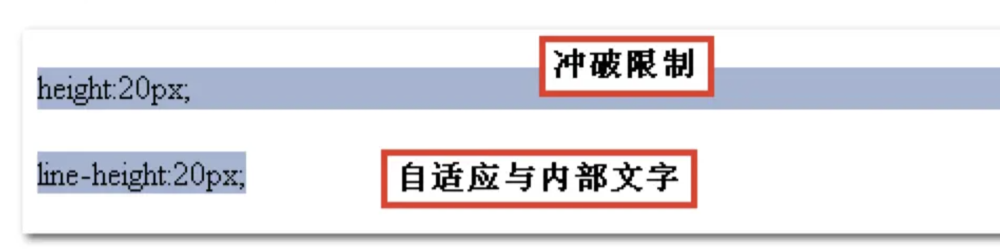


