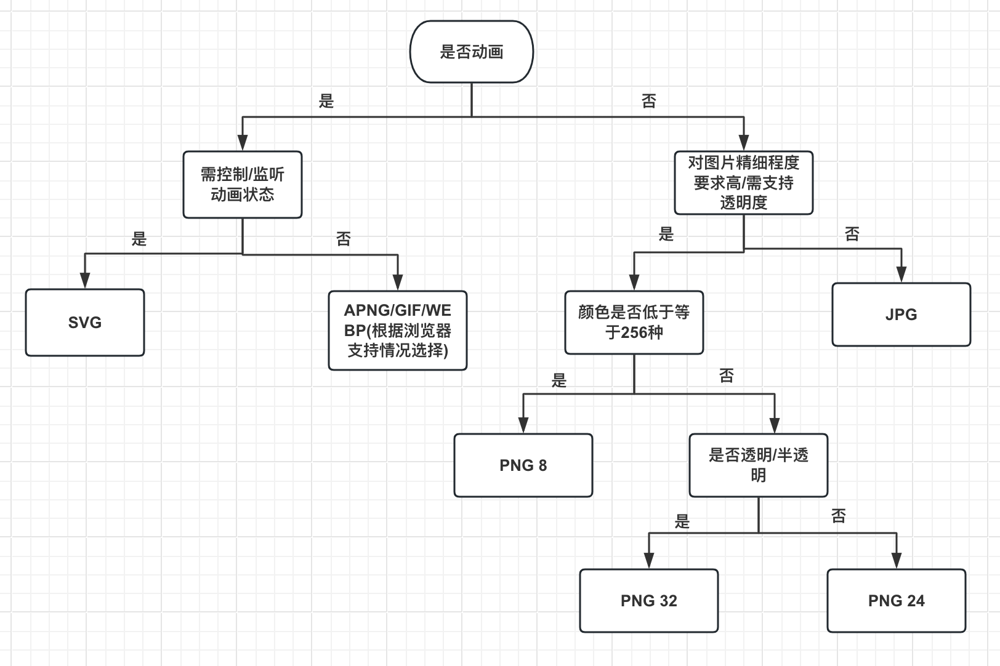

# H5 有哪些 drag 相关的 API？

- `dragstart`：事件主体是`被拖放元素`，在开始拖放`被拖放元素`时触发
- `drag`：事件主体是`被拖放元素`，在正在拖放`被拖放元素`时触发
- `dragend`：事件主体是`被拖放元素`，在整个拖放操作结束后触发
- `dragenter`：事件主体是`目标元素`，在`被拖放元素`进入某元素时触发
- `dragover`：事件主体是`目标元素`，在`被拖放元素`在某元素內移动时触发
- `dragleave`：事件主体是`目标元素`，在`被拖放元素`移出某元素时触发
- `drop`：事件主体是`目标元素`，在`目标元素`完全接受`被拖放元素`时触发
  
# title 与 h1 的区别、b 与 strong 的区别、i 与 em 的区别？

`title` 标签是定义文档的标题，在所有 `HTML` 文档中是必需的，放在 `head` 标签下，定义浏览器工具栏中的标题、提供页面被添加到收藏夹时的默认标题、显示在搜索引擎结果中的标题

`h1` 标签定义 `HTML` 标题，放在 `body` 标签下，对页面信息的抓取作用很大

`b` 标签定义粗体文本，`strong`标签是短语标签，用来定义重要的文本，起到加重语气的效果。视觉上都是字体加粗，搜索引擎更侧重 `strong` 标签。没有特别的要求应使用 `CSS` 样式

`i` 标签定义与文本中其余部分不同的部分并把这部分文本呈现为斜体；`em` 标签是一个短语标签，用来呈现被强调的部分。视觉上都是斜体展示，没有特别的要求应使用 `CSS` 样式

> 短语标签：在 `HTML` 中，短语标签是`专用标签`，用于指示文本块具有`结构意义`，执行与文本格式标签类似的特定操作

# 页面导入样式时，使用 link 和 @import 有什么区别？

- `link` 是 `XHTML` 标签，无兼容问题；`@import` 是 `CSS2.1` 提出的，低版本的浏览器不支持
- `link` 是 `XHTML` 标签，除了加载 `CSS` 外还可定义 `RSS` 事务、定义`rel` 链接属性等；`@import` 是 `CSS` 提供的语法规则，只能加载 `CSS`
- `link` 引入 `CSS` 时，在页面载入时同时加载；`@import` 引入 `CSS` 时会等页面完全载入后再加载
- `link` 支持使用 `js` 控制 `DOM` 去改变样式；`@import` 不支持

# 如何禁用 a 标签跳转页面或定位链接？

- 标签属性 `href`，使其指向空或不返回任何内容
  ```js
  <a href="javascript:void(0);">xxx</a>
  <a href="javascript:;">xxx</a>
  ```

- 从标签事件入手，阻止其默认行为
  ```js
  // HTML 方法
  <a href="" onclick="return false;">xxx</a>
  <a href="#" onclick="return false;">xxx</a>
  
  // 在 JS 中阻止默认点击事件
  event.preventDefault();
  
  // 还可在 CSS 中处理点击，不响应任何鼠标事件
  pointer-events: none;
  ```

# canvas 在标签上设置宽高，和在 style 上设置宽高有什么区别？

`canvas` 标签的 `width` 和 `height` 是画布实际宽高，绘制的图形都在这个画布上

`style` 设置的 `width` 和 `height` 是 `canvas` 在浏览器中被渲染的宽高

若 `canvas` 的宽高没指定或值不正确，就会被设置成默认值


# 使用 input 标签上传图片时，怎样触发默认的拍照功能？

`capture` 属性用于指定文件上传控件中媒体拍摄的方式，可选值：
- `user` 前置
- `environment` 后置
- `camera` 相机
- `camcorder` 摄像机
- `microphone` 录音 
```js
<input type="file" accept="image/*;" capture="camera" />
```

# 什么是 DOM 和 BOM？

`DOM` 指文档对象模型，把文档当作一个对象，这个对象主要定义了`处理网页内容`的方法和接口

`BOM` 指浏览器对象模型，把浏览器当作一个对象来对待，这个对象主要定义了`与浏览器进行交互`的方法和接口

> - `BOM` 的核心是 `window`，而 `window` 对象具有双重角色，它既是通过 `js` 访问浏览器窗口的一个接口，也是一个 `Global`（全局）对象，这意味着在网页中定义的任何对象、变量、函数都作为全局对象的一个属性或方法存在
> - `window` 对象包含有 `location`、`navigator`、`screen` 等子对象
> - `DOM` 的最根本的对象 `document` 也是 `BOM` 的 `window` 的子对象

# 简述超链接 target 属性的取值和作用

`target` 属性一共有四个值：
- `_self`：默认属性。在当前窗口或框架中加载目标文档
- `_blank`：打开新的窗口或新的标签页。在使用这个属性时，最好添加 `rel="noopener norefferrer"` 属性，防止打开的新窗口对原窗口进行篡改，防止 `window.opener` API 的恶意行为
- `_parent`：在 `frame` 或 `iframe` 中使用较多。在父级框架中载入目标文档，当 `a` 本身在顶层时与 `_self` 相同（如在页面中嵌套一个 `iframe1`，在 `iframe1` 里嵌套一个 `iframe2`，则 `iframe2` 里的超链接就会在 `iframe1` 打开且会覆盖 `iframe1` 的所有内容）
- `_top`：在 `frame` 或 `iframe` 中使用较多。直接在顶层的框架中载入目标文档，加载整个窗口，不管嵌套多少层 `iframe` 都会在最顶层打开
- `任意字符`：若当前浏览器还没打开这个链接，则会弹出新窗口打开此链接，与 `_blank` 一致；若已打开了这个链接，则不会再重复弹出第二个窗口，而是刷新已打开的窗口链接

# HTML 全局属性(global attribute)有哪些（包含 H5）？

| 属性 | 描述 |
| --- | --- |
| class | 规定元素的类名（classname） |
| id | 规定元素的唯一 id |
| style | 规定元素的行内样式（inline style） |
| accesskey | 设置访问元素的键盘快捷键 |
| dir | 设置元素中内容的文本方向 |
| lang | 设置元素中内容的语言代码 |
| tabindex | 设置元素的 Tab 键控制次序 |
| title | 规定元素的额外信息（可在工具提示中显示） |
| translate | 指定是否一个元素的值在页面载入时是否需要翻译 |
| contenteditable(New) | 规定是否可编辑元素的内容 |
| contextmenu(New) | 指定一个元素的上下文菜单。当用户右击该元素，出现上下文菜单 |
| data-*(New) | 用于存储页面的自定义数据 |
| spellcheck(New) | 检测元素是否拼写错误 |
| draggable(New) | 指定某个元素是否可以拖动 |
| dropzone(New) | 指定是否将数据复制，移动，或链接，或删除 |
| hidden(New) | hidden 属性规定对元素进行隐藏 |

# 常见的浏览器内核都有哪些？

内核主要分为`渲染引擎`和 `JS 引擎`
- 前者负责页面的渲染即在浏览器窗口中显示所请求的内容，后者负责执行解析和执行 `JS` 脚本
- 后者负责执行解析和执行 `JS` 脚本
  
之后由于 `JS` 引擎越来越独立，现在所说的浏览器内核大多指`渲染引擎`
- `Trident`：IE，由微软开发
- `EdgeHtml`：edge12-18
- `Gecko`：FireFox，使用 `C++` 开发的渲染引擎，包括了 `SpiderMonkey` 即我们熟悉的 `FireFox`
- `Presto`：`Opera` 使用的内核，`Opera <= 12.18`
- `Webkit`：前端使用最多的 `Chrome` 和 `Safari` 使用的内核，`Chrome < 28`
- `Blink`：`Chrome > 28`(JS 引擎为 V8 引擎)、`Opera > 12.18`、`Edge` 新版、一些国产浏览器
  
> 百度 `T5`、腾讯 `X5`，UC `U3`等内核都基于 `Blink` 优化，`Blink` 由`Webkit` 中的 `WebCore` 元件衍生而来

# 导致页面加载白屏时间长的原因有哪些？怎么进行优化？

`白屏时间`：用户点击一个链接或打开浏览器输入URL地址后，从屏幕空白到显示第一个画面的时间
> 当用户点开一个链接或直接在浏览器中输入URL开始进行访问时，就开始等待页面的展示。页面渲染的时间越短，用户等待的时间就越短，用户感知到页面的速度就越快。这样可以极大的提升用户的体验，减少用户的跳出，提升页面的留存率

白屏的过程：从输入url，到页面的画面展示的过程
- 1、首先，在浏览器地址栏中输入 url
- 2、浏览器先查看浏览器缓存-系统缓存-路由器缓存，若命中缓存，会直接在屏幕中显示页面内容；若没有，则跳到第三步操作
- 3、在发送 http 请求前，需域名解析(DNS 解析)，解析获取相应的 IP 地址
- 4、浏览器向服务器发起 tcp 连接，与浏览器建立 tcp 三次握手
- 5、握手成功后，浏览器向服务器发送 http 请求，请求数据包
- 6、服务器处理收到的请求，将数据返回至浏览器
- 7、浏览器收到 HTTP 响应
- 8、读取页面内容，解析 html 源码，浏览器开水渲染
- 9、生成 DOM 树、解析 CSS 样式、JS 交互，渲染显示页面

浏览器下载 HTML 后，首先解析头部代码，进行样式表下载，然后继续向下解析 HTML 代码，构建 DOM 树，同时进行样式下载。当 DOM 树构建完成后，立即开始构造 CSSOM 树。理想情况下，样式表下载速度够快，DOM 树和 CSSOM 树进入一个并行的过程，当两棵树构建完毕，构建渲染树，然后进行绘制

**Tips: 浏览器安全解析策略对解析 HTML 造成的影响**
- 当解析 HTML 时遇到内联 JS 代码，会阻塞 DOM 树的构建，先执行完 JS 代码
- 当 CSS 样式文件没有下载完成时，浏览器解析 HTML 遇到了内联 JS 代码，此时，浏览器暂停 JS 脚本执行和 HTML 解析。直到 CSS 文件下载完成、完成 CSSOM 树构建后，重新恢复原来的解析

> JS 会阻塞 DOM 生成，而样式文件又会阻塞 JS 的执行，所以在实际的工程中需重点关注 JS 文件和样式表文件，使用不当会影响到页面性能

**白屏-性能优化**
- `DNS 解析优化`：针对 `DNS Lookup` 环节，可以针对性的进行 `DNS` 解析优化
  - `DNS` 缓存优化
  - `DNS` 预加载策略
  - 稳定可靠的 `DNS`服务器

- `TCP` 网络链路优化
  
- `服务端处理优化`：非常庞大的话题，会涉及到如 `Redis` 缓存、数据库存储优化或系统内的各种中间件以及 `Gzip` 压缩等…
  
- 浏览器下载、解析、渲染页面优化
  - 尽可能的精简 `HTML` 的代码和结构
  - 尽可能的优化 `CSS` 文件和结构 
  - 一定要合理的放置 `JS` 代码，尽量不要使用内联的 `JS` 代码
  - 将渲染首屏内容所需的关键 `CSS` 内联到 `HTML` 中，能使 `CSS` 更快速地下载，在 `HTML` 下载完成后就能渲染，页面渲染的时间提前从而缩短首屏渲染时间
  - 延迟首屏不需要的图片加载，而优先加载首屏所需图片（`懒加载`）

# JS 和 CSS 是如何影响 DOM 树构建的？

**结论**：CSS 不会阻塞 DOM 的解析，但会影响 JS 的运行；JS 会阻止 DOM 树的解析，CSS（CSSOM）会影响 DOM 树的渲染，也可说最终会影响渲染树的生成

**JS 脚本在 HTML 页面中**
```js
<html>
  <body>
    <div>1</div>
    <script>
      let div1 = document.getElementsByTagName('div')[0]
      div1.innerText = 'test'
    </script>
    <div>test</div>
  </body>
</html>
```
当解析到 script 脚本标签时，HTML 解析暂停，JS 引擎执行 script 标签中的内容

这段 JS 脚本修改了 DOM 中第一个 div 中的内容，所以执行这段脚本后 div 节点内容已经修改为 'text'。脚本执行完后，HTML 解析器继续进行解析后续的内容，直到解析完成生成最终的 DOM 


**HTML 页面中引入 JS 文件**
```js
<html>
  <body>
    <div>1</div>
    <script type="text/javascript" src='test.js'></script>
    <div>test</div>
  </body>
</html>
```

整个执行流程还是一样，执行到 JS 标签时，暂停整个 DOM 的解析去执行 JS 代码
```
这里需要重点关注下载环境，因为 JS 文件的下载过程会阻塞 DOM 解析，而通常下载又是非常耗时的，会受到网络环境、JS 文件大小等因素的影响
```

谷歌浏览器做了很多优化，其中一个主要的优化就是`预解析操作`。当渲染引擎收到字节流后，会开启一个预解析线程，用来分析 HTML 文件中包含的 JS、CSS 等相关文件，**预解析线程会提前下载这些文件**

针对“引入 JS 线程会阻塞 DOM”的问题，可以使用一些策略来优化，如：使用 CDN 来加速 JS 文件的加载、压缩 JS 文件的体积等

若 JS 文件中没有操作 DOM 相关代码，可通过使用 async 或 defer 将该 JS 脚本设置为`异步加载`
```js
<script async type="text/javascript" src='test.js'></script>
<script defer type="text/javascript" src='test.js'></script>
```

`async` 和 `defer` 区别：
- `async`：脚本并行加载，加载完成后立即执行，执行时机不确定，仍有可能阻塞 HTML 解析，执行时机在 `load` 事件派发前
- `defer`：脚本并行加载，等待 HTML 解析完成后按照加载顺序执行脚本，执行时机在 `DOMContentLoaded` 事件派发前

**HTML 页面中有 CSS 样式**
```js
//test.css
div {color:blue}

<html>
<head>
    <style src='test.css'></style>
</head>
<body>
  <div>1</div>
  <script>
      let div1 = document.getElementsByTagName('div')[0]
      div1.innerText = 'test' // 需要 DOM
      div1.style.color = 'red' // 需要 CSSOM
  </script>
  <div>test</div>
</body>
</html>
```

JS 代码中的 div1.style.color = ‘red’ 的语句是用来操作 CSSOM 的，在执行 JS 前需要先解析 JS 语句之上所有的 CSS 样式，若代码里引用了外部的 CSS 文件，在执行 JS 前还需要等待外部的 CSS 文件下载完成，并解析生成 CSSOM 对象后才能执行 JS 脚本

JS 引擎在解析 JS 前是不知道 JS 是否操作了 CSSOM，所以渲染引擎在遇到 JS 脚本时，不管该脚本是否操作了 CSSOM，都会执行 CSS 文件下载、解析操作，再执行 JS 脚本，所以 JS 脚本是依赖样式表的，这又多了一个阻塞过程

> **通过上面的分析，JS 会阻塞 DOM 生成，而样式文件又会阻塞 JS 的执行**

# HTML 和 CSS 中的图片加载与渲染规则

`img`、`picture` 或 `background-image` 均是 DOM 树或样式规则中的一部分，则图片加载和渲染的时机可能如下面：
- 解析 HTML 时，若遇到 `img` 或 `picture` 标签，将会加载图片
- 解析加载的样式遇到 `background-image` 时，**并不会加载图片**，而会构建样式规则树
- 加载和执行 JS 代码，若代码中有创建 img 元素之类，会添加到 DOM 树中；若有添加 background-image 规则，将会添加到样式规则树中
- DOM 树和样式规则匹配时构建渲染树，若 DOM 树节点匹配到样式规则中的 backgorund-image，则会加载背景图片、计算元素（图片）位置进行布局
- 开始渲染图片，浏览器将呈现渲染出来的图片
  
**结论：Web 页面中不是所有的图片都会加载和渲染！**

可以归纳为：
- `img`、`picture` 和设置 `background-image` 的元素遇到 `display:none` 时，图片会加载，但不会渲染
- `img`、`picture` 和设置 `background-image` 的元素的`祖先元素`设置 `display:none` 时，`background-image` 不会渲染也不会加载，而 `img` 和 `picture` 引入的图片会加载但不会渲染
- `img`、`picture` 和设置 `background-image` 的元素`引入相同路径、相同图片文件名`时，图片只会加载一次
- 样式文件中 `background-image` 引入的图片，若匹配不到 `DOM` 元素，图片不会加载
- 伪类引入的 `background-image`，如 `:hover`，只有当伪类被触发时，图片才会加载

# 前端如何选择图片格式？

**图片的类型：**
- `位图`：用`像素点`拼起来的图也叫`点阵图`，平时用到的 `png`、`jpg` 等图片就是位图
- `矢量图`：也叫做`向量图`。**矢量图并不纪录画面上每一点的信息**，而是**纪录元素形状及颜色的算法**，当打开一幅矢量图时，软件对图形对应的函数进行运算，将运算结果图形的形状和颜色展示出来
  > 无论显示画面是大还是小，画面上的对象对应的算法是不变的，即使对画面进行倍数相当大的缩放，它也不会像位图那样会失真
  > 
  > 常见的就是 `svg` 格式

图片的压缩类型：
- `无压缩`：不对图片数据进行压缩处理，能准确地呈现原图片。例如BMP格式的图片
  
- `有损压缩`：指在压缩文件大小的过程中损失了一部分图片信息，即降低了图片质量（图片被压糊），且这种损失是不可逆的
  > 常见的有损压缩手段：按照一定的算法将临近的像素点进行合并
  >
  > 压缩算法**不会对图片所有的数据进行编码压缩**，而是**在压缩时去除了人眼无法识别的图片细节**
  >
  > 因此有损压缩可以**在同等图片质量的情况下大幅降低图片的体积**，如 `jpg` 格式的图片使用的就是有损压缩

- `无损压缩`：在压缩图片的过程中图片的质量没有任何损耗，任何时候都可以从无损压缩过的图片中恢复出原来的信息
  > 压缩算法**对图片的所有的数据进行编码压缩**，能在保证图片质量的同时降低图片的体积，如 `png`、`gif` 使用的就是无损压缩

**图片位数：通常分为 `8、16、24、32`**
- 图片位数越大，能表示的颜色越多，同时占用的体积也越大，如 8 位图片支持 256 种颜色，即 2^8
- 图片位数越大，颜色过渡也就越细腻，携带的色彩信息也更丰富
- 32 位跟 24 位的区别：多了一个 Alpha，用来支持半透明，其他的跟 24 位基本一样

**常见的图片格式：**

`JPEG/JPG`：
- JPEG (Joint Photographic Experts Group)，文件后辍名是 `"．jpg"` 或 `"．jpeg"`，是常用的图像文件格式
- 由一个软件开发联合会组织制定，是一种**有损压缩格式**，能够将图像压缩在很小的储存空间，图像中重复或不重要的信息会被丢失，因此容易造成图像数据的损伤
- 尤其是若使用过高的压缩比例，将使最终解压缩后恢复的图像质量明显降低，因此若追求高品质图像，不宜采用过高压缩比例
- 渐进式 jpeg(progressive jpeg)：渐进式 jpg 文件包含多次扫描，这些扫描顺序的存储在 jpg 文件中
  > 打开文件过程中，会先显示整个图片的模糊轮廓，随着扫描次数的增加，图片变得越来越清晰

`GIF`：
- GIF (Graphics Interchange Format)，1987 年由 Compu Serve 公司为了填补**跨平台图像格式**的空白而发展起来的
- 采用 `Lempel-Zev-Welch（LZW）` 压缩算法，最高支持 `256` 种颜色，由于这种特性，**GIF 比较适用于色彩较少的图片**，如卡通造型、公司标志等（若需用 24 位真彩色的场合，则 GIF 的表现力就很有限了）
- GIF 格式图片最大的特性：`帧动画`
  > 相比古老的 BMP 格式，**尺寸较小**，且**支持透明**(不支持半透明，因为不支持 Alpha 透明通道 )和**动画**

`PNG`：
- PNG，即便携式网络图形，是一种无损压缩的位图片形格式，其目的是试图替代 GIF 和 TIFF 文件格式，同时增加一些 GIF 文件格式所不具备的特性
- PNG 使用从 `LZ77` 派生的无损数据压缩算法，它的压缩比高，生成文件体积小，一般应用 `JAVA` 程序、网页或 S60 程序中
- PNG 支持 8 、24、32 位 3 种，通常叫做：`png8、png24、png32`

`APNG`：
- APNG (Animated Portable Network Graphics)， 是一个基于 PNG 的位图动画格式
- 实际上就是多张 PNG 组成的动图，MAC 电脑打开可以看到组成 apng 的每一张图

`WEBP`：
- WebP 是由 Google 最初在2010年发布，目标是**减少文件大小**，它能**同时支持无损压缩和有损压缩**
- 它几乎集成了以上所有图片的优点，且能够拥有更高的压缩率，但浏览器支持率可能还不够理想

`SVG`：
- SVG 是一种用 XML 定义的语言，用来描述二维矢量及矢量/栅格图形
- SVG 提供了 3 种类型的图形对象：**矢量图形（如：由直线和曲线组成的路径）**、**图象**、**文本**。图形对象还可进行分组、添加样式、变换、组合等操作，特征集包括嵌套变换、剪切路径、alpha 蒙板、滤镜效果、模板对象和其它扩展
- SVG 图形是可交互的和动态的，可在 SVG 文件中嵌入动画元素或通过脚本来定义动画
- SVG 与上面图片不同的是它是**矢量图**，**无论怎么放大或缩小都不会失真**；同时，**SVG 文件通常要比比 JPEG 和 PNG 格式的文件要小很多**

| 图片格式 | 优点 | 缺点 |
| --- | --- | --- |
| JPEG/JPG | - 采用有损压缩，压缩后体积更小<br/>- 支持24位真彩色<br/>- 支持渐进式加载 | - 有损压缩会损坏图片的质量<br/>- 不支持透明/半透明 |
| GIF | - 无损压缩，体积小<br/>- 支持动画 | 采用8位压缩，最多只能处理256种颜色 |
| PNG | - 无损压缩<br/>- 支持透明、半透明<br/>- 最高支持 24 位真彩色图像以及 8 位灰度图像，从而彻底地消除锯齿边缘 | - 与 jpg 的有损耗压缩相比，png提供的压缩量较少<br/>- 不支持动画，如需支持动画还得使用 apng |
| APNG | - 支持 PNG 的所有优点<br/>- 支持动画 | 浏览器支持情况较差 |
| WEBP | - 几乎集成了其他所有图片的优点<br/>- 拥有更高的压缩率 | 浏览器支持率可能还不够理想 |
| SVG | - 可被非常多的工具读取和修改（如记事本）<br/>- 与 JPEG 和 GIF 图像比起来，尺寸更小，且可压缩性更强<br/>- 可伸缩<br/>- 图像可在任何的分辨率下被高质量地打印<br/>- 可在图像质量不下降的情况下被放大<br/>- 可以与 JS 技术一起运行<br/>- 文件是纯粹的 XML | - 渲染成本相对于其他格式图片比较高，对于性能有影响<br/>- 需要学习成本，因为 SVG 是一种用 XML 定义的语言 |

**如何选择图片的格式**

